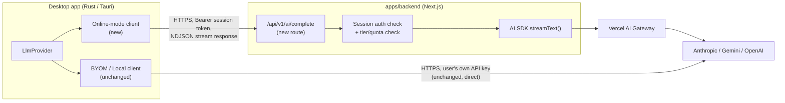
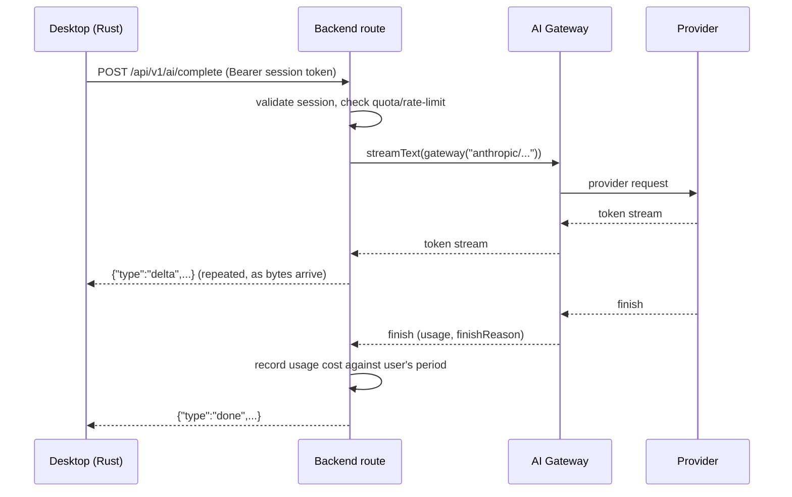

# Design Doc: Backend-Proxied Online AI (Streaming)

Status: **Draft — precursor to implementation plan.** Numbers, table names, and
field names below are proposed, not final. This document exists to capture
the architecture and decisions reached during design discussion so a
phased implementation plan can be drawn from it.

## 1. Summary

Today, when the desktop app runs in "online" AI mode, `apps/desktop/src-tauri`
calls Anthropic/Gemini/OpenAI directly from Rust using either a bundled key or
the user's own key. This changes: **all "online" mode AI requests will be
routed through `apps/backend`**, which proxies to the model providers via the
**Vercel AI SDK** and **AI Gateway**. The desktop and backend communicate over
a streaming HTTP connection using a custom NDJSON envelope (defined below).

**BYOM (bring-your-own-model) is explicitly out of scope for this change** —
it continues to call providers directly from Rust exactly as it does today,
using the user's own key and `base_url`. Local mode (the bundled `llama-server`
sidecar) is also unaffected.

## 2. Goals / Non-Goals

**Goals**
- Move "online" mode's provider credentials out of the desktop client entirely
  — Amicus holds the only API keys, via one AI Gateway credential.
- Support streaming responses end-to-end (provider → Gateway → backend →
  desktop) so the UI can render tokens as they arrive and avoid request
  timeouts on long generations.
- Enforce cost controls per user so no single customer's usage can produce
  runaway spend against the shared Gateway key.
- Keep the change additive to the existing `LlmProvider` abstraction — BYOM
  and local-mode code paths are untouched.

**Non-Goals**
- Agentic tool-use / multi-step autonomous behavior. This is a single-call
  (streamed) proxy, not an agent runtime. (See §8, "Why not an agent SDK".)
- Changing how BYOM or local mode work.
- Finalizing exact dollar quota amounts per tier — those are a product/finance
  decision to be filled in before implementation, not an engineering one.

## 3. Current State (for reference)

- `apps/desktop/src-tauri/src/llm/llm_provider.rs` — `LlmProvider` enum
  (`Claude`/`Gemini`/`OpenAi`/`Mock`/`Local`) with non-streaming
  `call_simple`/`call_structured`, each provider hitting its API directly
  over `reqwest`.
- `apps/desktop/src-tauri/src/llm/llm_settings.rs` — `load_active_provider`
  picks a provider from locally-stored `AiConfig` (`ai_mode`:
  `local`/`online`/`byom`); `check_ai_health` already gates cloud/BYOM checks
  behind `crate::auth::is_pro_tier(&app)`.
- `apps/desktop/src-tauri/src/auth/mod.rs` — the existing desktop↔backend
  identity bridge (Phase 0 / AMI-37): a `Session { token, email, tier,
  expires_at }` persisted locally, verified against
  `POST /api/v1/auth/desktop-session`, refreshed on focus. **This session
  token is the auth mechanism the new AI proxy route reuses** — no new
  desktop-side auth concept is introduced.
- `apps/backend/database/schema.ts` — `users.tier` is a Postgres enum
  (`"free" | "pro"`) already. No AI usage/quota tables exist yet.
- Call sites that use `LlmProvider` today (unchanged by this work, aside from
  which provider variant they resolve to): `indexer/mod.rs`,
  `query/llm.rs`, `email/emails_classify_llm.rs`, `llm/field_extraction.rs`,
  `llm/cloud_transcribe.rs`.

## 4. Target Architecture



Key property: **the desktop never talks to the Gateway or to a model provider
directly in online mode.** It only ever calls the backend, authenticated with
the session token it already has from the existing identity bridge. Gateway
credentialing (OIDC / `AI_GATEWAY_API_KEY`) is entirely backend-internal and
invisible to the desktop.

## 5. Modules to Build

### 5.1 Backend (`apps/backend`)

| Module | Responsibility |
|---|---|
| `app/api/v1/ai/complete/route.ts` (new) | Accepts the desktop's request (prompt, system, model hint, `structured` flag), validates the session token, runs the quota/rate-limit pre-check, calls `streamText()` via AI Gateway, translates the AI SDK stream into the NDJSON envelope, writes it as the chunked response body. |
| Quota/usage service (new, e.g. `lib/ai/usage.ts`) | On each `finish` event: computes dollar cost from `usage.inputTokens`/`usage.outputTokens` × the model's list price, writes/increments the user's usage-period row, checked against their plan's budget *before* the request is allowed to proceed. |
| Plan/tier config (new, e.g. `lib/ai/plans.ts` or a `plans` table) | Maps `users.tier` → monthly AI dollar budget + Gateway rate-limit tier. Data-driven so adding "Ultra" later is a config/row addition, not a code branch. |
| Model price table (new, e.g. `lib/ai/pricing.ts`) | Per-model input/output $-per-token, used by the usage service. Needs periodic upkeep as providers change pricing. |
| Auth reuse | The route reuses the **existing** `desktop_sessions`/`users` tables and the same bearer-token validation pattern already implemented for `/api/v1/auth/desktop-session` — no new desktop-side auth is introduced. |

### 5.2 Desktop (`apps/desktop/src-tauri`)

| Module | Responsibility |
|---|---|
| New provider variant on `LlmProvider` (e.g. `LlmProvider::BackendOnline`) | Calls the backend's `/api/v1/ai/complete` instead of a provider directly, only when `ai_mode == "online"`. `byom` and `local` continue resolving to the existing `OpenAiProvider`/`LocalProvider` paths untouched. |
| NDJSON stream reader (new, e.g. `llm/backend_stream.rs`) | Wraps `reqwest::Response::bytes_stream()`, buffers partial lines, parses each complete line as one `StreamEvent`, exposes it two ways: (a) buffered — accumulate `delta` text and return the joined `String` once `done` arrives, satisfying the existing `call_simple`/`call_structured` signatures unchanged; (b) live — optional callback/Tauri-event emission per `delta`, for a future interactive surface. |
| Error mapping | Maps `StreamEvent::Error{code, message, retry_after_seconds}` to the existing `Result<String, String>` error channel `LlmProvider` callers already expect, with `code` preserved so a future UI can distinguish `quota_exceeded` / `rate_limited` / `provider_error`. |
| Auth plumbing | Attaches the existing `Session.token` (already read via `auth::get_session`) as `Authorization: Bearer` on the backend call — no new credential storage. |

### 5.3 Database (Postgres / Drizzle, `apps/backend/database`)

Three additions (exact column names/types TBD in the implementation plan):

- **`plans`** — **resolved: a DB table, not code config.** One row per tier:
  `tier` (matches `users.tier`), `monthly_budget_cents` (int — Pro seeded at
  `2000`, i.e. $20.00), `gateway_rate_limit_tier`. Adding "Ultra" later is an
  `INSERT`, not a deploy. Rationale in §11.
- **`ai_usage_periods`** — one row per `(user_id, billing_period)`, a running
  `cost_cents` counter (integer, not float — avoid floating point for money)
  updated on every completed or partially-completed request. This is the
  fast pre-request quota check; kept as a rollup separate from the detail
  log below so the hot-path check doesn't need to `SUM()` across every
  request every time.
- **`ai_requests`** (new — resolves observability, §9) — one row per backend
  AI call: `user_id`, `conversation_id` (nullable UUID, for grouping
  multi-turn exchanges once an interactive surface exists — `NULL` for
  today's single-shot callers), `purpose` (`chat` / `email_classification` /
  `field_extraction` / `doc_indexing` / `query_analysis`), `model`, `prompt`
  (nullable — see below), `response` (nullable — absent on a
  pre-generation failure, or when content logging is disabled),
  `input_tokens`, `output_tokens`, `cost_cents`, `finish_reason`,
  `error_code` (nullable), `created_at`. Source of truth that
  `ai_usage_periods` is derived from. `prompt`/`response` are subject to the
  retention/opt-out policy in §9 — the numeric/metadata columns are not, and
  are kept regardless so quota enforcement and billing history stay intact
  even after content is purged or was never logged.
- `users.tier` enum needs a migration to add `"ultra"` when that tier is
  actually built — not needed for this phase, called out so it isn't
  forgotten.

## 6. Streaming Protocol — NDJSON Envelope

One JSON object per line, over a chunked-transfer-encoding HTTP response body.
Chosen over raw-text streaming (no room for metadata/errors) and over proxying
the AI SDK's own UI Message Stream protocol (richer than needed; no existing
Rust client for it — would mean hand-rolling an SSE parser for a protocol
surface that's mostly unused here anyway).

```
{"type":"delta","text":"Hello"}
{"type":"delta","text":" world"}
{"type":"done","finishReason":"stop","usage":{"inputTokens":12,"outputTokens":8}}
```

On failure, in place of (or instead of a subsequent) `done`. `retryable` tells
the desktop whether a "Retry" affordance makes sense at all; `partial` tells
it whether any `delta` lines were already sent for this request (see §8):

```
{"type":"error","code":"rate_limited","message":"...","retryAfterSeconds":8,"retryable":true,"partial":false}
{"type":"error","code":"quota_exceeded","message":"...","retryable":false,"partial":false}
{"type":"error","code":"provider_error","message":"...","retryable":true,"partial":true}
```

`quota_exceeded` is always `retryable:false` — retrying immediately just
fails again; the desktop's response is an explicit upgrade prompt, not a
retry button (§7).

**Why an explicit `done`/`error` line is necessary, not optional:** HTTP's
status line is sent once, before the body streams — once the backend's 200
has gone out, there's no HTTP-level way to signal a failure that occurs
mid-stream. The `error` line is the only place left to put that signal;
without it, a dropped connection and a clean finish look identical to the
reader.



## 7. Cost Control: Quota vs. Rate Limit

These are two independent constraints, both required:

| | Quota | Rate limit |
|---|---|---|
| Constrains | Total spend over a billing period | Request/token *frequency* over a short window |
| Purpose | Keep per-customer AI cost within what their subscription funds | Catch bursts — bugs, retry storms, abuse |
| Enforced where | Backend, before calling Gateway (new `ai_usage_periods` check) | AI Gateway (dashboard-configured per-`user` RPM/TPM/concurrency) |
| Detected via | Your own DB check | HTTP 429 from Gateway, surfaced by the AI SDK (`APICallError` with `statusCode === 429`, `retry-after` header) |
| On violation | Reject before any provider call is made; no cost incurred | Reject before any provider call is made; no cost incurred |

**Layered defense, each catching what the layer above misses:**

1. **Backend-side dollar quota** (per user, per billing period) — the layer
   that actually enforces unit economics per plan.
2. **Gateway per-user rate limits** (dashboard-configured, keyed on the same
   user id as the existing auth bridge) — burst/abuse safety net, independent
   of billing cycles.
3. **Org-wide Gateway budget alert + hard cap** — last-resort backstop for
   when 1 and 2 both have a bug, a leaked key, or an unanticipated spike. Set
   well below the threshold that would actually hurt, not at expected spend.

**Why dollar-denominated, not token-denominated:** confirmed in discussion
that only ~40–50% of the Pro subscription price is earmarked for AI cost —
that's a *dollar* constraint, and a flat token cap doesn't track it well
because per-token cost varies by 10–25x across models (e.g. Haiku vs. Opus).
Tracking actual `tokens × model list price` against a dollar budget maps
directly to the business constraint and stays correct as the model mix
shifts, at the cost of needing to keep the price table (§5.1) current as
providers change pricing.

**Why plan config is data, not branches:** a second tier ("Ultra") is already
planned. The quota-check code should look up `(tier) → budget` from
config/table, not contain per-tier `if` branches, so adding Ultra is a
config/row change, not a logic change requiring every call site to be found
and edited. **Resolved: `plans` is a DB table (§5.3)**, seeded with Pro at
$20/month — not a compile-time constant, so a budget change or a new tier is
an `UPDATE`/`INSERT`, not a redeploy.

**At quota exhaustion:** hard block, surfaced as
`{"type":"error","code":"quota_exceeded",...}` (§6). The desktop's response
is an **explicit user action — an upgrade prompt** — not a silent downgrade
to a cheaper model and not an automatic retry. The user should always know
why a request stopped working and what to do about it, rather than getting
degraded output with no explanation.

## 8. Retry Policy

"Retry" means something different depending on whether any output has
already reached the desktop, so the policy splits on that:

**Pre-stream failures** (fails before the first `delta` is sent). Rely on
the AI SDK's/Gateway's own built-in retry with exponential backoff for
transient errors (5xx, network blips, `overloaded_error`) — this happens
entirely inside the backend's call to `streamText()`, invisible to the
desktop. Only if those internal retries are exhausted does the backend
surface `{"type":"error","code":"provider_error","retryable":true,"partial":false}`.
Since nothing was streamed yet, a client-initiated retry (a fresh request)
is clean.

**Mid-stream failures** (at least one `delta` already sent). **No
server-side auto-retry.** Once bytes have reached the desktop — and
possibly the user's screen — a server-side retry can't cleanly "continue":
reissuing the prompt generates a *new*, possibly different response, and
silently appending it to what's already shown risks duplicated or
contradictory text. Instead, terminate the stream immediately with
`{"type":"error","code":"provider_error","retryable":<bool>,"partial":true}`.
`partial:true` tells the desktop what it has is incomplete, not finished.
The desktop then decides whether to offer a "Retry" affordance that the
**user explicitly triggers**, starting a brand-new request — the same
principle already applied to rate limits (§6/§7): never auto-retry once
output has started, because the user is actively watching it.

**Retryable vs. non-retryable:** transient (5xx, network failure,
`overloaded_error`) → `retryable:true`; permanent (400 bad request,
content-policy refusal, invalid model id) → `retryable:false`, since
retrying identically fails identically.

**Billing on mid-stream failure:** if the provider generated some output
before failing, the provider already billed those tokens — record the
`usage` that arrived before the failure against the user's `ai_usage_periods`
counter (§5.3) even though the response is incomplete. Pre-stream failures
generate nothing and are never charged.

## 9. Observability: Request & Cost Logging

Beyond what AI Gateway's dashboard already provides (aggregate spend,
latency, failover chains), the backend keeps its own record of every AI
call in **`ai_requests`** (§5.3) — prompt, response, model, tokens, cost,
and outcome (`finishReason` or `error_code`), tied to `user_id` and an
optional `conversation_id` for grouping multi-turn exchanges once an
interactive chat surface exists. This is what answers "what did this
customer ask, what did the model say, what did it cost" for support/billing
disputes without needing Gateway dashboard access — and it's the detail log
`ai_usage_periods` (§5.3, §7) is derived from.

**Confirmed required — Amicus is a legal case-management platform**, and
`ai_requests` will contain the actual content of documents, queries, and
emails routed through cloud AI, not just metadata. That's a materially
different exposure than storing token counts: it may include privileged or
confidential client material, and Amicus (as vendor) would be able to read
it. The specific policy below is a **starting proposal for this design doc,
not a legal decision** — it should be reviewed by whoever owns Amicus's
customer contracts/DPAs before implementation, not treated as final because
an engineering doc proposed it.

Proposed default:

- **Bounded content retention.** Keep `ai_requests.prompt`/`.response` for a
  fixed window (e.g. 90 days) — long enough to support billing disputes and
  debugging, not indefinite. After the window, null out `prompt`/`response`
  on the row (a scheduled purge job) while keeping `model`, `input_tokens`,
  `output_tokens`, `cost_cents`, `finish_reason`, `created_at` — the
  cost/audit trail (§7, §9) never needs the content itself, only the numbers.
- **Per-customer content-logging opt-out.** A flag (e.g.
  `plans.content_logging_enabled` or a per-`users` override) that, when off,
  makes the backend skip writing `prompt`/`response` entirely for that
  customer — metadata/cost rows still get written (quota enforcement still
  needs them), only the content columns are skipped. This is what lets a
  customer with a "we never store your data" contractual term actually be
  honored, rather than retention period being the only lever.
- **Encrypt `prompt`/`response` at rest**, beyond whatever disk-level
  encryption the Postgres host (Neon) already provides by default — a
  column-level or application-level encryption key Amicus controls, so a
  database backup/snapshot leak doesn't expose plaintext case content on its
  own.
- **Audit access to stored content**, not just store it — reading a
  customer's `prompt`/`response` (e.g. for a support investigation) should
  itself be logged: who looked, when, why. Aggregate cost/usage queries
  (§7) don't need this; reading the actual content does.
- **Cascade on document/case deletion.** If a customer deletes a document or
  case, `ai_requests` rows whose content derived from it should be purged,
  not orphaned indefinitely with no link back to a decision the customer
  already made to delete the source material.

None of the above is implemented by this document — it's the shape of the
policy the implementation plan should turn into actual schema fields (the
`content_logging_enabled` flag, the purge job, the encryption approach) and
actual sign-off, not something to build silently as a default.

## 10. Testing Strategy

Per the explicit constraint: mock the model interface, not a server. The AI
SDK ships exactly this — `MockLanguageModelV4`, imported from `ai/test`,
passed directly as the `model:` param to `generateText`/`streamText` in
place of `gateway('anthropic/...')`. It's an in-process object implementing
the model interface — no HTTP call, no server process to start or tear down.

```ts
import { MockLanguageModelV4 } from 'ai/test'
import { simulateReadableStream } from 'ai'

// Non-streaming — canned response, for testing auth/quota logic around the route
const model = new MockLanguageModelV4({
  doGenerate: async () => ({
    content: [{ type: 'text', text: 'Hello, world!' }],
    finishReason: { unified: 'stop', raw: undefined },
    usage: { /* ... */ },
    warnings: [],
  }),
})

// Streaming — scripted chunk sequence, for testing the NDJSON translation layer
const streamingModel = new MockLanguageModelV4({
  doStream: async () => ({
    stream: simulateReadableStream({
      chunks: [
        { type: 'text-start', id: 'text-1' },
        { type: 'text-delta', id: 'text-1', delta: 'Hello' },
        { type: 'text-delta', id: 'text-1', delta: ', world!' },
        { type: 'text-end', id: 'text-1' },
      ],
    }),
  }),
})
```

- **Non-streaming (`doGenerate`)** — exercises quota/auth logic without
  streaming mechanics.
- **Streaming (`doStream`)** — exercises the NDJSON-translation layer for a
  normal completion.
- **Mid-stream error** — script the chunk sequence to fail partway through
  `doStream` to exercise the `partial:true`/`retryable` path from §8. The
  exact error-chunk shape wasn't confirmed in what's documented publicly —
  **verify against the installed `ai` package version when writing the
  test**, since the mock model class itself has moved
  (`MockLanguageModelV1` → `V2` → … → `V4`) across `ai` major versions.

On the Rust side, the NDJSON line-parser is plain unit-testable: feed it
byte buffers — including deliberately split mid-line, since real TCP chunks
won't respect JSON line boundaries — and assert on the reconstructed event
sequence. No network or mock server needed there either.

## 11. Key Decisions (recap)

| Decision | Chosen | Rejected | Why |
|---|---|---|---|
| LLM access library | Vercel AI SDK | LangChain | This is a thin multi-provider proxy, not a chain/RAG/agent pipeline — AI SDK's `streamText`/`generateText` map directly onto the existing `call_simple`/`call_structured` shape; LangChain's abstractions (chains, memory, agents) solve problems this task doesn't have. |
| Agent framework | None | Claude Agent SDK, OpenAI Agents SDK, Google ADK | All three are harnesses for an *agentic loop* (planning, built-in tools, autonomous multi-step work). This backend does one thing: relay a single (streamed) completion. Reaching for an agent harness here would be adopting a much heavier runtime for a problem that doesn't need one. |
| Multi-provider routing | Vercel AI Gateway | Direct per-provider SDK calls from the backend | One unified interface across Anthropic/Gemini/OpenAI, zero token markup, built-in per-user rate limiting, cost tagging, and failover — removes the provider-selection logic that currently lives in `llm_provider.rs::get_active_provider` from needing a backend-side re-implementation. |
| Desktop↔backend wire format | Custom NDJSON envelope | Raw text stream; AI SDK's UI Message Stream (SSE) protocol | Raw text has no room for `done`/`error`/usage signaling. The full SSE protocol is richer than needed and has no existing Rust client — NDJSON needs the same amount of custom Rust parsing code with a simpler grammar (no `data:` framing, no blank-line delimiters). |
| Auth for the new route | Reuse existing `Session` bearer token | New desktop-side credential | The Phase 0 identity bridge already solves "does the backend trust this desktop instance," including tier — nothing new needed. |
| Quota unit | Dollar cost (computed from token usage × model price) | Flat token count | Matches the actual business constraint (a % of subscription price funds AI), stays correct across a multi-provider, multi-price-tier model mix. |
| Plan/budget storage | DB table (`plans`) | Hardcoded code constant | Explicit requirement: tier budgets (Pro = $20) must be adjustable without a redeploy, and a second tier ("Ultra") is already planned. |
| Mid-stream failure handling | No server-side retry; surface `partial`+`retryable`, desktop offers a user-triggered fresh request | Server-side retry-and-splice mid-stream | Bytes already delivered to the desktop can't be cleanly "continued" — same never-auto-retry-after-first-byte principle already used for rate limits. |
| Test mocking strategy | `MockLanguageModelV4` (`ai/test`) + `simulateReadableStream` | A local mock HTTP server | In-process, nothing to run/manage in CI — matches the explicit "no mock server" requirement. |

## 12. Problems & Solutions

| Problem | Solution |
|---|---|
| Desktop currently needs its own (or the user's own) API key to reach providers in "online" mode. | Backend proxies the call; only the backend/Gateway holds provider credentials. |
| Once a 200 is sent, HTTP has no way to signal a later failure. | In-band `{"type":"error",...}` line in the NDJSON envelope. |
| A single shared Gateway key means one runaway customer can spike cost for everyone. | Layered defense: backend $ quota → Gateway per-user rate limit → org-wide budget alert (§7). |
| Free-tier users shouldn't cost anything. | Existing `is_pro_tier` gate (already in `check_ai_health`) extends to the new backend route — enforced server-side, not just trusted from the client. |
| Token quotas don't reflect real dollar cost across models of very different price. | Dollar-cost quota computed from `usage × price table`, not a flat token cap. |
| A future "Ultra" tier shouldn't require touching quota-check logic. | Tier→budget mapping is data (config/table), not hardcoded branches. |
| Existing non-interactive callers (`indexer`, `email classification`, `field extraction`) expect a single buffered `String`, not a live stream. | Rust's stream reader accumulates `delta` text and returns the joined string on `done` — same signature as `call_simple`/`call_structured` today; only a future interactive surface would consume deltas live. |
| Need to test the streaming/error paths without standing up infrastructure. | AI SDK's `ai/test` mock model classes — in-process, no server (§10). |
| Chat/document content routed through cloud AI needs to be inspectable for support and cost attribution. | `ai_requests` detail table (§9), source of truth for the `ai_usage_periods` rollup. |
| A retry after partial streamed output risks confusing or duplicate content for the user. | No server-side retry once any `delta` has been sent; `partial`+`retryable` flags let the desktop offer an explicit, user-triggered fresh request instead (§8). |

## 13. Resolved Since Initial Draft

Answers reached in follow-up discussion, superseding the original open
questions:

| Question | Resolution |
|---|---|
| Exact Pro budget | **$20/month**, stored in the `plans` table (§5.3) — not hardcoded. |
| `plans`: DB table or code config? | **DB table.** Follows directly from the above — a value that must change without a redeploy can't live in compiled code. |
| Behavior at quota exhaustion | **Hard block + explicit upgrade prompt.** No silent model downgrade, no silent retry (§7). |
| Backend model override | **No, for now.** The desktop/user explicitly selects the model, same as today via `ai_model`. Revisit only if a future phase stops exposing model choice to the end user. |
| Retry policy for `provider_error` | **Resolved — see §8.** Pre-stream: rely on AI SDK/Gateway's built-in retry. Mid-stream: no server-side retry; `partial`+`retryable` flags hand the decision to the user. |
| Request/cost observability beyond Gateway's dashboard | **Yes — the backend stores chats and cost.** New `ai_requests` table (§5.3, §9). Retention/compliance policy for that stored content is a separate open item, below. |
| Testing strategy | **Resolved — see §10.** AI SDK's `ai/test` mock model classes; no mock HTTP server. |
| Track BYOM/local usage for analytics symmetry? | **No, and moot longer-term** — BYOM is expected to eventually route through AI Gateway as well (via Gateway's BYOK mode, keeping the user's own key), at which point it gets the same `ai_requests`/Gateway observability for free. Out of scope for this phase; current BYOM behavior (§1, §2) is unaffected until that's undertaken as separate work. |

## 14. Still Open

- **Exact Ultra tier budget** — **deferred, ignore for now.** Pro is set
  ($20/mo in `plans`); the Ultra row gets added whenever that tier is
  actually defined — no design work blocked on it.
- **Retention & compliance policy for `ai_requests`** — **confirmed
  required** (§9 has a proposed default: bounded retention + purge job,
  per-customer content-logging opt-out, encryption at rest for
  `prompt`/`response`, access auditing, cascade-on-deletion). The proposal
  itself still needs sign-off from whoever owns Amicus's customer
  contracts/DPAs before the implementation plan treats it as final — an
  engineering design doc isn't the right place for that decision to
  originate from.
- **Exact mid-stream error-chunk shape** for `MockLanguageModelV4.doStream`
  (§10) — verify against the installed `ai` package version during
  implementation; not confirmed in what was checked for this doc.
- `users.tier` enum migration for `"ultra"` — deferred until that tier is
  actually built (§5.3).

## 15. Metadata Extraction Strategy Flag (decoupling from `is_local`)

**Surfaced during plan review, not part of the original scope, but directly
caused by this migration's context:** local AI mode was already removed
from the desktop Settings UI (AMI-65) while the underlying code (`LlmProvider::Local`,
`is_local` checks) stays in place. Document indexing currently decides
heuristic-vs-LLM metadata extraction by checking whether the active
provider is `Local`:

```rust
// apps/desktop/src-tauri/src/indexer/mod.rs — both index_file and index_folder
let is_local = matches!(provider, LlmProvider::Local(_));
let options = IndexOptions {
    run_llm_metadata: !is_local && crate::auth::is_pro_tier(&app),
    run_vector_embeddings: true,
};
```

With local mode gone from the UI, `is_local` becomes an unreliable signal
for "should we skip the LLM and use heuristics" — it's now vestigial
(only true for stale pre-migration local-mode settings, if any), not a
deliberate choice. The extraction strategy should be decoupled from
provider selection entirely.

**Decision: a hardcoded internal flag, matching an existing precedent.**
`apps/desktop/src-tauri/src/query/mod.rs` already has exactly this pattern
for a closely related decision (LLM-assisted query analysis/reranking vs.
FTS-only heuristics): `pub const USE_FTS_ONLY: bool = true;`, combined with
runtime flags via `&&`. Metadata extraction gets the same treatment rather
than a new mechanism (no config table, no env var, no settings UI toggle —
this is explicitly a developer-flippable constant, not a user-facing
setting):

```rust
pub const USE_HEURISTIC_METADATA_ONLY: bool = true;
```

Both `indexer/mod.rs` call sites change to:

```rust
let options = IndexOptions {
    run_llm_metadata: !USE_HEURISTIC_METADATA_ONLY && crate::auth::is_pro_tier(&app),
    run_vector_embeddings: true,
};
```

`is_local` is removed from this computation entirely (confirmed: it has no
other use at either call site). The `is_pro_tier` gate is preserved
unchanged — this flag controls *strategy*, not the existing Pro-tier
paywall on LLM-based extraction.

**Default: `true` (force heuristic).** Chosen to match `USE_FTS_ONLY`'s
existing default of forcing the cheap/deterministic path, and to keep
indexing free of any LLM cost — including cost through the new backend
proxy (§4, §7) — until deliberately flipped. Once `false`, LLM metadata
extraction for Pro-tier users routes through the backend proxy exactly like
any other online-mode call (§4) — this flag doesn't create a second, parallel
extraction pathway, it only gates whether `load_active_provider`'s
LLM-calling branch is reached at all.
