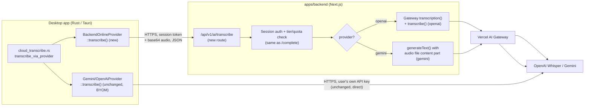

# Design Doc: Backend-Proxied Voice Transcription

Status: **Draft — precursor to implementation plan.** Tracked as **AMI-78**.
This is a direct follow-up to `ai_online_proxy_architecture.md` /
`implementation_plan.md` (AMI-67, merged) — that work explicitly deferred
voice out of scope (see its "Known Gaps / Not Yet Supported" section) and
left a placeholder error in `cloud_transcribe.rs`. This document closes that
gap. Everything below was verified against the actual merged code, not
assumed from the AMI-67 doc's forward-looking notes (some of which turned
out to need correction once checked — see §3).

## 1. Summary

Since AMI-67, the desktop's main AI Provider ("online" `ai_mode`) proxies
through `apps/backend`'s `/api/v1/ai/complete` route — Amicus holds the only
provider credentials for chat/indexing/query/email-classification calls.
**Voice input was explicitly left out of that migration.** Today, cloud voice
transcription (`transcribe_audio_cloud`) always constructs a *direct*
provider (Gemini or OpenAI) using a key from the dedicated Voice Input Engine
settings — there is no way to transcribe audio through the backend proxy at
all, so a user who wants managed/no-BYOM-key voice input cannot get it.

This document extends the backend-proxy architecture to voice: a new backend
endpoint that accepts audio and returns a transcript, a `transcribe()` method
on `BackendOnlineProvider`, and rewiring the two voice call sites
(`transcribe_audio_cloud`, `extract_field_value`) plus their frontend callers
so voice's cloud engine gets the same online/BYOM choice the main AI Provider
already has.

## 2. Goals / Non-Goals

**Goals**
- A backend route that accepts audio bytes + provider/model selection and
  returns a transcript, authenticated and quota-gated the same way
  `/api/v1/ai/complete` is.
- `BackendOnlineProvider::transcribe()`, mirroring the shape of
  `call_simple`/`call_structured`.
- Voice's cloud engine gains a real online-vs-BYOM distinction — today it
  has none; it always behaves like BYOM (see §3.3).
- Preserve the existing per-provider capability split (Gemini + OpenAI only;
  Claude/local/mock stay explicitly unsupported for voice) — unchanged from
  today.

**Non-Goals**
- Streaming transcription (Gateway's `experimental_transcription` WebSocket
  surface, live partial results). Today's Rust transcription is
  request/response (record → send whole clip → get transcript back); this
  stays request/response. No product requirement for live partials exists.
- Redesigning the Voice Input Engine model-selection UI. §3.4 documents a
  real conflation in today's model dropdown (it silently governs different
  things for Gemini vs. OpenAI) — this doc preserves that behavior exactly
  rather than fixing it, since re-scoping the settings UI is a separate,
  larger product conversation than "make voice work without a BYOM key."
- Changing local voice input (`transcribe_audio_local`, the bundled
  whisper-server sidecar) — completely unaffected, as today.
- Changing BYOM voice behavior — a user who sets a `voice_cloud_api_key`
  keeps getting the exact direct-provider behavior they get today.

## 3. Current State (verified against merged code)

### 3.1 Desktop transcription flow

- `VoiceFieldFiller.tsx` (the real production path — Document Fields, New
  Case, etc.): reads `ai_configurations` via `get_ai_settings`, branches on
  `voice_engine` ("local" | "cloud"). For `"cloud"`, it always calls
  `transcribe_audio_cloud` with an **explicit** `provider`
  (`voice_cloud_provider`) and `apiKey` (`voice_cloud_api_key`), then calls
  `extract_field_value` with the **same** explicit `provider`/`apiKey`
  override for the extraction step.
- `SettingVoiceEngine.tsx` (Settings UI): its "Test Transcription" widget
  calls `transcribe_audio_cloud` the same explicit way. Its "Run Health
  Check" button is the **only** place voice currently distinguishes
  online/BYOM at all — it computes `mode = byomOpen ? "byom" : "online"`
  (`byomOpen` is a purely client-side, non-persisted panel-visibility flag)
  and passes it to `check_ai_health`, which does have an online branch
  (AMI-67 Phase 8). This distinction exists **only** for the health-check
  ping, not for real transcription.
- `cloud_transcribe.rs::transcribe_audio_cloud` (`#[tauri::command]`):
  ```rust
  let resolved_provider = match provider {
      Some(provider_type) => get_active_provider(ProviderConfig { provider_type, api_key, model, base_url: None }),
      None => super::llm_settings::load_active_provider(&app, api_key, model, "chat")?,
  };
  ```
  Since `VoiceFieldFiller.tsx`/`SettingVoiceEngine.tsx` always send `Some(provider)`
  for the cloud engine, the `None` branch (which *would* resolve to
  `BackendOnline` via `load_active_provider`'s existing online branch) is
  **never reached by any voice caller** — confirmed by grep, `extract_field_value`
  has exactly one call site (`VoiceFieldFiller.tsx`) and it's the same story.
  This is why AMI-67's `LlmProvider::BackendOnline(_) => Err("...")` arm in
  `transcribe_via_provider` is dead code in practice today — nothing
  constructs a `BackendOnline` provider for voice at all, the explicit-override
  path always wins.
- `cloud_transcribe.rs::transcribe_via_provider` dispatches
  `Gemini`/`OpenAi` to their own `.transcribe()` methods, and returns an
  explicit unsupported-error string for `Claude`/`Local`/`Mock`/`BackendOnline`.

### 3.2 Backend AI proxy — text only

- `apps/backend/app/api/v1/ai/complete/route.ts` is the only AI route. It
  parses `{ token, prompt, system?, provider, model, structured?, purpose? }`
  — text in, text out via `streamText()`. There is no audio-accepting route.
- `lib/ai/models.ts::resolveGatewayModel(provider, model)` maps a canonical
  model id to a Gateway *language*-model namespace (`anthropic/…`,
  `google/…`, `openai/…`) and rejects anything not in its allowlist. It has
  no notion of transcription models at all.
- `lib/ai/pricing.ts::computeCostCents(model, inputTokens, outputTokens)` is
  purely token-based. Transcription cost is not token-shaped for at least
  one provider (see §7) — this function cannot be reused unmodified.
- `lib/ai/usage.ts` (`checkQuota`, `recordUsage`, `recordAiRequest`) is
  provider/request-shape agnostic — it only needs a `costCents` number and a
  `purpose`, so it composes with a new endpoint without modification.
- Auth: `desktop_sessions`/`users` lookup, same token-in-body convention,
  same free-tier 403 — the same shape the new route needs, already proven.

### 3.3 The BackendOnline provider — already built, but text-only

`BackendOnlineProvider` (Phase 7/8 of AMI-67, already merged) has
`backend_url`, `session_token`, `provider`, `model`, `purpose`, and
`call_simple`/`call_structured`, both POSTing to `/api/v1/ai/complete` and
parsing the NDJSON stream via `backend_stream::LineBuffer`. **Reusable
as-is:** `auth::get_backend_url(app)` / `auth::get_session_token(app)` (Phase
5) already exist and already work — no new auth plumbing needed, unlike
AMI-67 which had to build that from scratch.

**What's missing is purely a `transcribe()` method** plus a way to actually
construct a `BackendOnline` provider for voice (see §3.1 — today nothing
does, for either transcription or extraction).

### 3.4 A real gotcha: the voice model dropdown means different things per provider

Confirmed by reading `llm_provider_openai.rs::transcribe()` and
`llm_provider_gemini.rs::transcribe()` side by side:

- **Gemini's `transcribe()`** calls `generateContent` on `self.model` — the
  exact model the user picked in `SettingVoiceEngine.tsx`'s dropdown
  (`gemini-3.1-flash-lite` / `gemini-3.5-flash`) is what actually performs
  the transcription (Gemini has no dedicated STT endpoint; transcription
  *is* a multimodal chat completion: audio bytes + "transcribe this"
  instruction).
- **OpenAI's `transcribe()` hardcodes `"model", "whisper-1"` in the
  multipart form** — `self.model` (whatever the dropdown says —
  `gpt-4o-mini`/`gpt-5.6-luna`/`gpt-5.6-terra`) is **silently ignored** for
  the transcription call itself. Those model ids are chat-completion models,
  not audio models — they can't do STT. The dropdown's selection only takes
  effect for OpenAI on the **extraction** step (`extract_field_value`'s
  `cloudModel` parameter), never on transcription.

This doc's backend replacement **preserves this exact behavior** — OpenAI
transcription always goes through Whisper server-side, independent of the
configured `voice_cloud_model`; Gemini transcription uses the configured
model, same as today. Fixing the UI to make this explicit (e.g. a
dedicated transcription-model field for OpenAI) is out of scope (§2).

## 4. Target Architecture



Key property, same as the text proxy: **the desktop never holds provider
credentials in online mode.** BYOM is untouched and keeps calling providers
directly.

## 5. Modules to Build

### 5.1 Backend (`apps/backend`)

| Module | Responsibility |
|---|---|
| `app/api/v1/ai/transcribe/route.ts` (new) | Accepts `{ token, audioBase64, mimeType, provider, model, language?, purpose? }`. Same auth/tier/quota gate as `/complete`. Dispatches to Gateway `transcribe()` (OpenAI) or `generateText()` with an audio file part (Gemini). Returns a single JSON response (not NDJSON — see §6), records usage/cost, returns `{ text }` or an error shape mirroring `/complete`'s error codes. |
| `lib/ai/models.ts` — extend | Add `resolveTranscriptionModel(provider, model)`: for `openai`, ignores the passed `model` and always resolves to the Gateway transcription id `openai/whisper-1` (§3.4 — preserves today's behavior); for `gemini`, resolves the passed `model` to a Gateway **language**-model id via the existing `resolveGatewayModel` (transcription is a `generateText` call for Gemini, not a transcription-model call). Rejects any other provider. |
| `lib/ai/pricing.ts` — extend | Add a duration-based cost function for OpenAI Whisper (`computeTranscriptionCostCents(durationSeconds)`) — Whisper is priced per-minute of audio, not per-token (§7). Gemini transcription reuses the existing token-based `computeCostCents` unchanged, since it's a normal `generateText` call with real input/output token usage. |
| `database/schema.ts` — extend | Add `"voice_transcription"` to `ai_requests.purpose`'s enum (currently `chat`/`email_classification`/`field_extraction`/`doc_indexing`/`query_analysis`) — see §9 for why this is worth a migration rather than reusing `"chat"`. |

### 5.2 Desktop (`apps/desktop/src-tauri`)

| Module | Responsibility |
|---|---|
| `BackendOnlineProvider::transcribe()` (new method, `llm_provider_backend_online.rs`) | POSTs to `/api/v1/ai/transcribe` with base64-encoded audio + mime type + language hint; parses the single JSON response (no NDJSON streaming needed — see §6); returns `Result<String, String>` with the same `CODE: message` error-prefix convention as `call_simple`/`call_structured`. |
| `cloud_transcribe.rs::transcribe_via_provider` — edit | Replace the `BackendOnline(_) => Err(...)` placeholder arm with `BackendOnline(p) => p.transcribe(audio_bytes, language.as_deref()).await` (needs a mime-type — see §6 for how that's derived). |
| Shared provider-resolution helper (new, e.g. `llm_settings.rs::resolve_voice_provider`) | Given voice's own `(mode, provider_type, model, api_key)`, returns either a `BackendOnline` provider (online) or a direct `ProviderConfig`-based provider (BYOM) — replaces the duplicated `Some(provider_type) => get_active_provider(...)` arms in both `cloud_transcribe.rs` and `field_extraction.rs`, and is what actually makes voice's online mode reachable (§3.1 — today it isn't, from either call site). |
| Mode derivation | `mode = if api_key.trim().is_empty() { "online" } else { "byom" }` — see §8 for why this needs no new persisted field. |

## 6. Wire Protocol

**Not NDJSON.** The `/complete` route streams because chat responses can be
long and users watch tokens arrive; a transcript is produced once, atomically,
by the provider (even the AI SDK's `transcribe()` is non-streaming — see
`ai/dist/index.d.ts`'s `transcribe()` signature, distinct from
`experimental_streamTranscribe`, which this doc doesn't use per §2). A plain
JSON request/response is simpler and matches what the Rust side already does
today (a single awaited call, not a stream reader).

**Request** (`POST /api/v1/ai/transcribe`):
```json
{
  "token": "…",
  "audioBase64": "…",
  "mimeType": "audio/wav",
  "provider": "gemini",
  "model": "gemini-3.5-flash",
  "language": "en",
  "purpose": "voice_transcription"
}
```
`audioBase64` matches the existing convention already used for Gemini in
`llm_provider_gemini.rs` (`STANDARD.encode(&audio_bytes)`) — Rust already
does this encoding for one of the two providers today, so this isn't new
client-side work, just applying it uniformly for both.

**Response** (200):
```json
{ "text": "the transcribed words" }
```

**Response** (error, same codes as `/complete`):
```json
{ "error": { "code": "quota_exceeded", "message": "...", "retryable": false } }
```
Rust's `BackendOnlineProvider::transcribe()` maps this to the same
`"QUOTA_EXCEEDED: ..."`/`"RATE_LIMITED: ..."`/`"PROVIDER_ERROR: ..."` string
convention `call_simple`/`call_structured` already use, so
`SettingVoiceEngine.tsx`'s existing `message.startsWith("QUOTA_EXCEEDED:")`
check (AMI-67 Phase 9) keeps working for voice without any frontend change.

**Auth/pre-flight failures** (401 missing/invalid token, 403 free tier) —
plain non-JSON-enveloped HTTP status + `{ error: string }` body, identical
to `/complete`'s pre-flight failures, since those never reach the
provider-dispatch step either.

## 7. Cost Model: Two Shapes, One Endpoint

| Provider | Transcription cost shape | Confirmed via |
|---|---|---|
| OpenAI (Whisper) | Per-minute of audio (`$0.006/min` as of Whisper's public pricing) — **not** input/output tokens. | `TranscriptionResult.durationInSeconds` (`ai/dist/index.d.ts`) is what the AI SDK actually surfaces for a transcription call — there is no token-usage field on that result. |
| Gemini | Per-token, same as any other `generateText` call (audio counts as input tokens, transcript as output tokens) — no separate "transcription price." | Gemini transcription is a plain multimodal `generateText` call (§3.4) — `result.usage` is the same shape `/complete` already bills from. |

**Decision:** `computeTranscriptionCostCents` branches on provider: OpenAI
uses `durationInSeconds × per-minute rate`; Gemini reuses the existing
token-based `computeCostCents`. Both still funnel into the same
`checkQuota`/`recordUsage`/`recordAiRequest` calls `/complete` already uses —
those functions only need a final `costCents` number, they're already
provider/shape-agnostic (§3.2).

**Quota check still happens before the provider call**, same hard-block
behavior as `/complete` (§7 of the original design doc) — a
`quota_exceeded` transcription request costs nothing.

## 8. Voice Mode Resolution: Online vs. BYOM

**Problem:** the main AI config has a real, persisted `ai_mode`
(`local`/`online`/`byom`). Voice's cloud engine has no equivalent — it's
either "local" or "cloud," and "cloud" has always meant "direct provider
call with `voice_cloud_api_key`" (BYOM-shaped), full stop. Making voice's
online mode reachable requires *some* way to decide, per request, whether to
build a `BackendOnline` provider or a direct one.

**Decision: derive it from whether `voice_cloud_api_key` is set — no new
persisted field.**
```rust
let mode = if api_key.trim().is_empty() { "online" } else { "byom" };
```
**Why:** a persisted `voice_ai_mode` field mirroring `ai_mode` was
considered and rejected — it would duplicate a decision the data already
implies. If the user hasn't entered a voice-specific key, there is nothing
for BYOM to use, so "online" is the only sensible resolution; if they have,
using it is the obviously-intended behavior. This also **matches an
existing pattern already in the codebase**: `SettingVoiceEngine.tsx`'s
`hasAutoOpenedRef` effect already auto-reveals the BYOM key panel exactly
when a key is already saved — the UI already treats "key present" as the
de facto mode signal, this decision just makes that real for the
transcription/extraction call path too, not only for the settings panel's
visual state.

**Capability gating** (`voiceCapability.ts::checkVoiceCapability`) needs a
matching update: today, cloud voice is disabled outright without an API
key (`AUDIO_CAPABLE_PROVIDERS.includes(provider) && apiKey.trim()`). Once
online mode exists, the no-key case should be enabled instead — gated on
Pro tier + signed in (mirroring the main AI Provider's online-mode gate),
not on having a key.

## 9. Purpose Enum: Add `"voice_transcription"`

`ai_requests.purpose` currently has `chat` as the catch-all AMI-67 assigned
to `cloud_transcribe.rs` ("voice input doesn't map cleanly to the other
categories" — true at the time, since nothing else fit). Now that voice gets
its own dedicated route, it's a distinct, identifiable kind of request, not
"chat" — adding an enum value is a one-line Drizzle schema change + migration,
and this is a legal case-management platform (per the original design doc's
§9) where knowing "how much of our AI spend/content-log volume is voice
transcription vs. chat" is a real operational question, not a nice-to-have.
Extraction (`extract_field_value`, whether voice-triggered or not) keeps its
existing `"field_extraction"` purpose unchanged — only the transcription
call itself gets the new value.

## 10. Testing Strategy

Same "mock the model interface, not a server" constraint as `/complete`.
Confirmed available: **`MockTranscriptionModelV4`**, exported from `ai/test`
alongside `MockLanguageModelV4` — an in-process transcription-model mock,
usable as the `model:` argument to `transcribe()` in place of
`gateway.transcription('openai/whisper-1')`. For the Gemini path (a
`generateText` call), the existing `MockLanguageModelV4` +
`simulateReadableStream`/`doGenerate` pattern from `/complete`'s own tests
applies unchanged.

Cases (`route.test.ts`, mirroring `/complete`'s structure): missing/invalid
token → 401; free tier → 403; quota exceeded → error response, provider
never called; OpenAI success → `{ text }` + duration-based cost recorded;
Gemini success → `{ text }` + token-based cost recorded; provider failure →
mapped error code, `errorCode` recorded via `recordAiRequest`.

On the Rust side: `BackendOnlineProvider::transcribe()` has no existing
precedent for unit testing beyond what `cloud_transcribe.rs`'s existing
`#[cfg(test)]` module already does (dispatch-arm testing, not real network
calls) — same precedent, no new test infrastructure needed.

## 11. Key Decisions (recap)

| Decision | Chosen | Rejected | Why |
|---|---|---|---|
| New route vs. extending `/complete` | New route (`/api/v1/ai/transcribe`) | Overload `/complete` with an audio field | `/complete` is text-in/text-out and streams; transcription is audio-in/text-out and doesn't stream. Different enough shape that forcing it into one route/response-format adds branching complexity for no reuse benefit. |
| OpenAI transcription path | AI Gateway's `transcription()` + SDK `transcribe()` | Hand-rolled `multipart/form-data` call to OpenAI's REST endpoint (mirroring today's Rust code) | Gateway already has a first-class transcription surface for OpenAI's Whisper-family models — reuse it rather than re-implementing the HTTP call server-side that Rust is being retired from doing client-side. |
| Gemini transcription path | `generateText()` with an audio `file` content part, via the existing Gateway *language*-model resolution | A dedicated Gateway transcription model | Gateway's `GatewayTranscriptionModelId` has no Gemini entry — Gemini transcription has only ever been a multimodal chat completion (confirmed in the existing Rust code, §3.4), so the backend replacement uses the same mechanism, just via `generateText` instead of a raw `generateContent` fetch. |
| OpenAI model dropdown behavior | Preserved exactly (hardcoded `whisper-1` server-side, dropdown only affects extraction) | Make the dropdown control the real transcription model | Out of scope (§2) — a real UX gap, but a separate, larger conversation than "make voice work without a BYOM key." |
| Voice online/BYOM mode | Derived from whether `voice_cloud_api_key` is set | A new persisted `voice_ai_mode` field | No new state needed; matches an existing UI convention (§8) that already treats "key present" as the mode signal. |
| Transcription cost model | Duration-based for OpenAI, token-based for Gemini, both feeding the existing `checkQuota`/`recordUsage` | A single unified "cost per request" flat fee | The two providers are billed completely differently upstream; flattening it would either overcharge one or undercharge the other relative to real provider cost. |
| `ai_requests.purpose` | Add `"voice_transcription"` | Reuse `"chat"` | Zero-cost schema change; gives real observability into voice-specific spend/volume on a platform where AI spend accounting already matters (§9). |
| Wire format | Plain JSON request/response | NDJSON (matching `/complete`) | Transcription isn't a streamed result even at the AI-SDK layer (§6) — NDJSON's only purpose in `/complete` was mid-stream delta/error signaling, which doesn't apply here. |

## 12. Problems & Solutions

| Problem | Solution |
|---|---|
| Voice's cloud engine has no way to reach the backend proxy at all — every call site force-constructs a direct provider. | New shared Rust resolution helper (§5.2) used by both `transcribe_audio_cloud` and `extract_field_value`, replacing the duplicated explicit-override match arms. |
| Backend has no audio-accepting route. | New `/api/v1/ai/transcribe` route, same auth/quota gate as `/complete`, dispatching per-provider (§4, §5.1). |
| OpenAI and Gemini transcription are billed in incompatible units (per-minute vs. per-token). | Provider-branching cost function feeding the same downstream `checkQuota`/`recordUsage` (§7). |
| No persisted signal distinguishes voice's "online" from "BYOM" today. | Derive from API-key presence — no schema/config addition (§8). |
| OpenAI's model dropdown silently does nothing for transcription today. | Explicitly preserved, not fixed, and documented so it isn't rediscovered as a surprise mid-implementation (§3.4, §2). |
| `ai_requests.purpose` has no bucket for voice specifically. | Add `"voice_transcription"` to the enum (§9). |

## 13. Still Open

- **Whisper's exact current per-minute price** — used for
  `computeTranscriptionCostCents` (§7); needs verification against OpenAI's
  live pricing page at implementation time, same caveat `pricing.ts`
  already carries for its other figures ("author's best recollection...not
  verified against live pricing").
- **Gemini transcription model catalog parity with `lib/ai/models.ts`'s
  existing allowlist** — `VOICE_CLOUD_MODELS`' Gemini entries
  (`gemini-3.1-flash-lite`, `gemini-3.5-flash`) need to already be (or be
  added to) `MODELS_BY_NAMESPACE.google` so `resolveTranscriptionModel`
  doesn't reject them — the AMI-67 plan flagged this exact recurrence risk
  for a "new audio-specific catalog"; here it's not a new catalog, just
  needs confirming those two ids are present in the existing one.
- **Whether OpenAI's hardcoded `whisper-1` should instead resolve through
  Gateway's newer `gpt-4o-transcribe`/`gpt-4o-mini-transcribe` models** —
  out of scope per §2/§3.4 (preserve current behavior), but worth a product
  conversation separately, since those are Gateway-native and arguably
  better transcripts than legacy Whisper.
