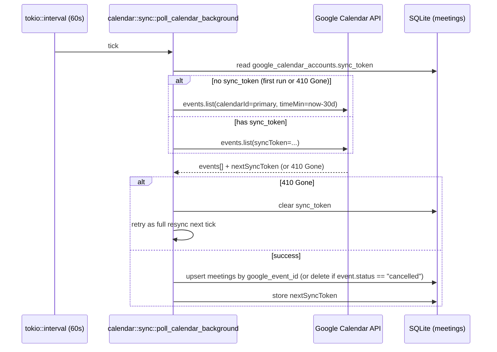

# Calendar Support — Design

Design for [ASC-163](https://linear.app/amicusx/issue/ASC-163/add-calendar-support) — a new Calendar tab backed by two-way-mirrored Google Calendar sync, meeting↔case linking, pre-meeting notifications, and calendar surfaces in case details and the home overview.

Companion to [`why-and-requirements.md`](./why-and-requirements.md) (motivation + clarified requirements) and [`brainstorm.md`](./brainstorm.md) (options considered per decision). [`plan.md`](./plan.md) phases this into buildable PRs.

---

## 1. Goals and non-goals

**Goals**

1. A new top-level Calendar tab with day/week/month views of meetings synced from the user's Google Calendar.
2. Google Calendar is authoritative: creating a meeting in Ascurix writes through to Google immediately; a background sync mirrors Google's state (including out-of-band edits) into a local `meetings` table.
3. A meeting description containing `"case: <name>"` / `"תיק: <name>"` auto-links the meeting to a matching case, using near-exact normalized matching only.
4. An OS-level notification fires shortly before a meeting starts, while Ascurix is running.
5. Case details gets a same-panel "Meetings" view (boxes/list, not a grid) plus a small upcoming-meetings card on the Overview panel.
6. The home page overview gets a "Today's Meetings" card.
7. Available on every subscription tier (no tier gating).

**Non-goals — explicitly out of scope** (see [`why-and-requirements.md`](./why-and-requirements.md) for the full rationale)

- Task-level attachment to a meeting.
- Local-only/offline meeting creation — Google connection is mandatory before the Calendar tab is usable.
- Fuzzy/confidence-tiered case matching for the description phrase — near-exact only, reusing `normalize_for_match`, not the full `match_email_core` pipeline.
- Recurring meeting *creation* from Ascurix (existing recurring Google events still sync in as individually-expanded instances).
- Multi-calendar support — one connected Google account, its primary calendar.
- Notifications while Ascurix isn't running — no system-tray/always-on service.
- Any new webhook/push-notification receiver — Google can't push to a desktop app with no public endpoint; sync is polling-based.

## 2. What exists vs. what is missing

| Capability | Status | Location |
|---|---|---|
| Top-level route table, `MemoryRouter` | ✅ | `apps/desktop/src/components/App/AppMain.tsx:8-19` |
| Home page tiles + cross-case overview panel | ✅ | `AppHome.tsx`, `AppHomeOverview.tsx` |
| Case-detail tab system (`activeRightTab` + `CaseDetailTab`) | ✅ | `CaseManagementOpenCasesDetails.tsx`, `CaseDetailSidebar.tsx` |
| Case overview small-card layout (tasks/emails cards) | ✅ | `CaseOverviewPanel.tsx`, `CaseOverviewTasksCard.tsx` |
| SQLite schema conventions (`_SCHEMA` consts, `execute_batch`, idempotent `ALTER TABLE` migrations) | ✅ | `store/mod.rs` |
| Single-row settings-table pattern (tokens/config) | ✅ | `auth/mod.rs` (`auth_session`), `llm/llm_settings.rs` (`ai_configurations`) |
| Deep-link OAuth redirect handling (`doron-desktop://...`) | ✅ | `lib.rs` `.setup()`, `tauri-plugin-deep-link` already a dependency |
| Background `tokio::time::interval` polling loop | ✅ | `email/emails_ops.rs::poll_emails_background` (pattern to mirror, not reused directly) |
| Hebrew/English text-normalization for case-name comparison | ✅ | `email/normalize.rs::normalize_for_match` |
| Label-detection regex idiom (`"תיק"`/`"case"` + delimiter) | ✅ | `email/emails_classify_deterministic.rs:53-57`, `case/identifiers.rs:148-152` (numeric-only today; needs a free-text variant) |
| `reqwest`, `tokio`, `chrono`, `regex` crates | ✅ | `apps/desktop/src-tauri/Cargo.toml` |
| Validated Google OAuth + Calendar API call shape | ✅ (Python spike) | `python/calender.py` — `InstalledAppFlow`, `events.list`, `events.insert`; reference only, not reused code |
| **`meetings` / `google_calendar_accounts` tables** | ❌ | new, §3 |
| **Google OAuth2 flow in Rust** | ❌ | new, §4 |
| **Sync poller** | ❌ | new, §5 |
| **Case-link phrase extraction (free-text name, not number)** | ❌ | new, §6 |
| **Any notification infrastructure** (OS or in-app) | ❌ | new, §7 — no `tauri-plugin-notification` dependency, no toast component anywhere |
| **Calendar Tauri commands** | ❌ | new, §8 |
| **Calendar frontend (`components/Calendar/`)** | ❌ | new, §9 |
| **Case-detail meetings panel / overview card** | ❌ | new, §10 |
| **Home "Today's Meetings" card / nav tile** | ❌ | new, §11 |

## 3. Data model

Two new tables in `store/mod.rs`, alongside the existing `_SCHEMA` constants, following the exact conventions documented in §2 (INTEGER PK, RFC3339 TEXT timestamps, `CHECK` enums, `idx_<table>_<col>` indexes, `ON DELETE` spelled out).

```sql
-- Single-row settings table, same shape as auth_session / ai_configurations.
CREATE TABLE IF NOT EXISTS google_calendar_accounts (
    id                INTEGER PRIMARY KEY AUTOINCREMENT,
    google_email      TEXT    NOT NULL,
    access_token      TEXT    NOT NULL,
    refresh_token     TEXT    NOT NULL,
    token_expires_at  TEXT    NOT NULL,
    sync_token        TEXT,
    connected_at      TEXT    NOT NULL
);

CREATE TABLE IF NOT EXISTS meetings (
    id               INTEGER PRIMARY KEY AUTOINCREMENT,
    google_event_id  TEXT    NOT NULL UNIQUE,
    case_id          INTEGER,
    title            TEXT    NOT NULL,
    description      TEXT,
    location         TEXT,
    start_time       TEXT    NOT NULL,
    end_time         TEXT    NOT NULL,
    status           TEXT    NOT NULL DEFAULT 'confirmed'
                             CHECK (status IN ('confirmed','tentative','cancelled')),
    case_link_source  TEXT   NOT NULL DEFAULT 'none'
                             CHECK (case_link_source IN ('none','phrase_match','manual')),
    created_at       TEXT    NOT NULL,
    updated_at       TEXT,
    FOREIGN KEY (case_id) REFERENCES cases(id) ON DELETE SET NULL
);
CREATE INDEX IF NOT EXISTS idx_meetings_case_id    ON meetings(case_id);
CREATE INDEX IF NOT EXISTS idx_meetings_start_time ON meetings(start_time);
```

Notes:
- `google_calendar_accounts` follows `auth_session`'s `DELETE FROM x; INSERT INTO x (...)` write pattern — connecting a new account replaces the row; there's exactly one connected account at a time (§1 non-goals: single calendar).
- `case_link_source` records *why* a meeting is linked to a case, distinguishing an auto-detected phrase match from a manual pick in the form — needed so the UI can show "detected from description" vs. "linked manually" and so re-parsing an edited description doesn't clobber a manual link.
- No `meeting_reminders` table: "already notified" state for the reminder scanner (§7) is tracked in-memory (a `HashSet<i64>` of meeting ids, reset on app restart) rather than persisted — acceptable because a missed/duplicate reminder across an app restart is a minor annoyance, not a correctness issue, and avoids a table whose only job is dedup bookkeeping.

## 4. Google OAuth & account connection

New module `apps/desktop/src-tauri/src/calendar/oauth.rs`. **Not** a deep-link redirect like backend login (`auth/mod.rs`) — confirmed against Google's current OAuth-for-native-apps docs that custom URI schemes are no longer accepted for "Desktop app" OAuth clients ("due to the risk of app impersonation"); only the loopback interface (`http://127.0.0.1:PORT`) is supported. Mirrors what Google's own quickstart samples do for installed apps, and what `python/calender.py`'s spike already validated via `run_local_server`:

1. User clicks "Connect Google Calendar" in the Calendar tab (shown whenever `google_calendar_accounts` is empty).
2. Rust (`oauth::connect`) binds a `tokio::net::TcpListener` to `127.0.0.1:0` (OS picks a free port), then opens the system browser to Google's OAuth consent URL (`scope=https://www.googleapis.com/auth/calendar`, `redirect_uri=http://127.0.0.1:{that port}`), using the OAuth client already provisioned (see the credential files flagged in `why-and-requirements.md`). The client ID/secret are embedded at **compile time** via `option_env!` (mirroring `SENTRY_DSN`'s treatment) — dev exports both locally, production sources them from GitHub Actions repo secrets wired into `release.yml`/`deploy-desktop.yml`.
3. Google redirects the browser to that loopback address with `?code=...`; a hand-rolled single-shot listener (`accept_redirect`, not a real HTTP server — Google only ever sends the one request) accepts the connection, parses `code` off the request line, and responds with a minimal "you can close this tab" page.
4. Rust exchanges `code` for `access_token`/`refresh_token` via `reqwest::Client::post("https://oauth2.googleapis.com/token", ...)` — same call shape as `auth::login_with_credentials` — passing the **exact** `redirect_uri` used in step 2 (Google validates it matches byte-for-byte).
5. Tokens persisted via `save_google_calendar_account_internal` (mirrors `save_session_internal`).
6. `get_valid_access_token(app)` (internal helper, used by every other calendar module) checks `token_expires_at`, refreshes via the refresh-token grant if expired, and re-persists — called at the top of every sync/create/list operation rather than duplicated per call site.

Because the whole flow (browser open → loopback catch → token exchange → persist) happens inside one `async fn` awaited directly by the `connect_google_calendar` command, the command only resolves once connecting has genuinely succeeded or failed — the frontend doesn't need to poll `get_google_calendar_status` waiting for a deep-link callback to land asynchronously.

`disconnect_google_calendar` command: `DELETE FROM google_calendar_accounts`, `DELETE FROM meetings` (local mirror has no meaning without the account it mirrors).

## 5. Sync engine



`apps/desktop/src-tauri/src/calendar/sync.rs`:

```rust
pub const CALENDAR_SYNC_INTERVAL: std::time::Duration = std::time::Duration::from_secs(60);

pub async fn poll_calendar_background(app: AppHandle) {
    let mut interval = tokio::time::interval(CALENDAR_SYNC_INTERVAL);
    interval.set_missed_tick_behavior(tokio::time::MissedTickBehavior::Delay);
    loop {
        interval.tick().await;
        if let Some(account) = get_google_calendar_account_internal(&app) {
            if let Err(e) = sync_once(&app, &account).await {
                println!("[Calendar Sync Error] {}", e);
            }
        }
    }
}
```
directly mirroring `poll_emails_background`'s shape (`email/emails_ops.rs:56-84`), spawned in `lib.rs::setup()` next to the existing email-poller spawn. `sync_once` does the `events.list` call (with or without `syncToken` per the diagram above), maps each Google event to a `meetings` row (`google_event_id`, title←`summary`, `description`, `location`, `start_time`/`end_time` from `start.dateTime`/`end.dateTime`, `status`), and **re-runs the case-link phrase match (§6) on every synced event**, not just ones created in-app — so a meeting created directly in Google Calendar with `"תיק: ..."` in its description still gets linked once it syncs in. An event whose Google `status` is `"cancelled"` deletes the local row rather than marking it cancelled-and-kept, since a cancelled Google event carries no useful remaining data.

Each Google event maps to exactly one `meetings` row; a Google recurring event is delivered by the API as already-expanded individual instances (each with its own `google_event_id`), which is why no recurrence-specific handling is needed in the sync loop itself (§1 non-goals).

## 6. Meeting creation & case-link matching

New `apps/desktop/src-tauri/src/calendar/case_link.rs`:

```rust
static CASE_PHRASE: Lazy<Regex> = Lazy::new(|| Regex::new(
    r#"(?i)(?:case|תיק)\s*[:\-]\s*(.+?)(?:\n|$)"#
).unwrap());

pub fn extract_case_phrase(description: &str) -> Option<String> {
    CASE_PHRASE.captures(description).map(|c| c[1].trim().to_string())
}

pub fn match_case_by_phrase(conn: &Connection, phrase: &str) -> Option<i64> {
    let normalized = normalize_for_match(phrase);
    // near-exact: normalized phrase == normalized case name/subject
    conn.query_row(
        "SELECT id FROM cases WHERE normalize_for_match_sql(name) = ?1 OR normalize_for_match_sql(subject) = ?1",
        params![normalized],
        |row| row.get(0),
    ).optional().ok().flatten()
}
```

(`normalize_for_match` is reused as-is from `email/normalize.rs`, per §2/§4 of `brainstorm.md` — this module deliberately does **not** call into `case_matcher/` or `match_email_core`.) The exact-match SQL comparison is illustrative; the real implementation normalizes case rows once (either a computed column or an in-memory pass over `list_cases`-equivalent data, whichever proves simpler against the existing `cases` table shape) rather than requiring a SQLite extension function — that's an implementation detail resolved during the PR that builds this, not a design commitment.

**`create_meeting` command flow** (`apps/desktop/src-tauri/src/calendar/mod.rs`):
1. Validate a Google account is connected (else error — the frontend shouldn't reach this state given R3, but the command defends independently).
2. Run `extract_case_phrase` → `match_case_by_phrase` if the frontend didn't already supply an explicit `case_id` (manual pick takes precedence over the phrase; sets `case_link_source = 'manual'` vs `'phrase_match'`).
3. `get_valid_access_token`, POST to `events.insert` via `reqwest`.
4. On success, insert the returned event locally (same row shape the sync poller produces) and return it to the frontend immediately — the UI doesn't wait for the next sync tick to show the new meeting.
5. On Google API failure, return an error to the frontend; nothing is written locally (no meeting should exist locally that doesn't exist in Google — consistent with §1 goal 2).

`update_meeting` / `delete_meeting` follow the same write-through-then-mirror shape (PATCH/DELETE to Google first, then update/delete the local row on success).

## 7. Reminder / notification engine

New dependency: `tauri-plugin-notification` (Rust crate + `@tauri-apps/plugin-notification` JS bindings), registered in `lib.rs` alongside the existing plugin list, with a new `"notification:default"` permission added to `capabilities/default.json` — same registration shape as every other plugin already listed there (§2).

`apps/desktop/src-tauri/src/calendar/reminder.rs`:

```rust
pub const REMINDER_SCAN_INTERVAL: std::time::Duration = std::time::Duration::from_secs(30);
pub const REMINDER_LEAD_TIME: chrono::Duration = chrono::Duration::minutes(5);

pub async fn remind_upcoming_meetings_background(app: AppHandle) {
    let mut interval = tokio::time::interval(REMINDER_SCAN_INTERVAL);
    let mut notified: HashSet<i64> = HashSet::new();
    loop {
        interval.tick().await;
        let now = chrono::Utc::now();
        for meeting in meetings_starting_within(&app, now, REMINDER_LEAD_TIME) {
            if notified.insert(meeting.id) {
                let _ = app.notification()
                    .builder()
                    .title(&meeting.title)
                    .body(&format!("Starting at {}", meeting.start_time))
                    .show();
            }
        }
    }
}
```
Spawned in `lib.rs::setup()` as a second, independent background task alongside the sync poller (§5) — deliberately separate loops rather than one combined loop, so a slow/failing Google API call never delays a time-sensitive reminder.

## 8. Tauri commands

All registered in `lib.rs`'s `generate_handler![]`, alongside the existing `case::*`/`email::*` entries:

| Command | Signature | Purpose |
|---|---|---|
| `connect_google_calendar` | `(app) -> ()` | Opens system browser to Google's consent screen |
| `get_google_calendar_status` | `(app) -> Option<GoogleAccountStatus>` | `{ google_email, connected_at }` or `None` — drives the connect-prompt vs. calendar-UI branch |
| `disconnect_google_calendar` | `(app) -> ()` | Clears account + local meetings |
| `create_meeting` | `(app, input: CreateMeetingInput) -> Meeting` | §6 |
| `update_meeting` | `(app, id: i64, input: UpdateMeetingInput) -> Meeting` | §6 |
| `delete_meeting` | `(app, id: i64) -> ()` | §6 |
| `list_meetings_for_range` | `(app, start: String, end: String) -> Vec<Meeting>` | Backs the day/week/month grid |
| `list_meetings_for_case` | `(app, case_id: i64) -> Vec<Meeting>` | Backs R7 panel + R8 card |
| `list_todays_meetings` | `(app) -> Vec<Meeting>` | Backs R9 home card |

## 9. Frontend architecture

```
apps/desktop/src/components/Calendar/
  Calendar.tsx                 -- header + nested <Routes>, mirrors TaskManagement.tsx
  CalendarHeader.tsx            -- mirrors TaskManagementHeader.tsx
  ConnectGoogleCalendarPrompt.tsx
  MonthGrid.tsx / WeekGrid.tsx / DayGrid.tsx   -- date-fns based, no calendar library
  MeetingForm.tsx                -- create/edit, existing modal idiom
  MeetingBox.tsx                 -- single meeting "card", reused by grids + case panel
apps/desktop/src/hooks/
  useMeetingList.ts               -- mirrors useTaskList shape
```

- New dependency: `date-fns` only (§8 of `brainstorm.md`).
- New route in `AppMain.tsx`: `<Route path="/calendar/*" element={<Calendar />} />`.
- `Calendar.tsx` renders `<ConnectGoogleCalendarPrompt />` when `get_google_calendar_status` returns `None` (R3: Google required), otherwise the grid + create button.
- `MeetingBox.tsx` is the shared "one meeting" rendering unit — used by the grid views, the case-detail meetings panel (§10), and the home "Today's Meetings" card (§11), so the visual shape of "a meeting" is defined once.

## 10. Case details integration (R7 / R8)

- `CaseDetailTab` (`CaseDetailSidebar.tsx`) gains `"meetings"`, alongside `"overview" | "preview" | "emails" | "tasks"`.
- A new sidebar entry point switches `activeRightTab` to `"meetings"`, rendering a new `CaseMeetingsPanel.tsx` in `CaseManagementOpenCasesDetails.tsx`'s existing tab-switch block (§C of the codebase research) — same mechanism as the Emails/Tasks tabs, **no modal**, per the explicit correction in `brainstorm.md` §7.
- `CaseMeetingsPanel.tsx` calls `list_meetings_for_case` via `useMeetingList`, renders `MeetingBox.tsx` cards in a boxes layout (not a grid view) — this is the "not in standard calendar view rather more as boxes view" requirement.
- `CaseOverviewPanel.tsx` gets a new `CaseOverviewMeetingsCard.tsx`, structurally identical to `CaseOverviewTasksCard.tsx` (same `rounded-md border border-border bg-muted/20 p-3` shell, `max-h-56 overflow-y-auto`), showing the next few upcoming meetings for the case with a "view all" link that switches to the `"meetings"` tab.

## 11. Home page integration (R9)

- `AppHomeOverview.tsx`'s existing `Promise.all([...])` (§B of the codebase research) gains `invoke<Meeting[]>("list_todays_meetings")`, and a fourth `CARD_CLASS` block ("Today's Meetings") is added to the card stack, following the exact same loading/error/empty pattern as the three existing cards.
- `AppHome.tsx` gets a third `NAV_TILE_CLASS` tile (`CalendarDays` icon, `t("calendar")` label) in the same `<div className="flex flex-col gap-16 ...">` block as the Cases/Documents tiles, navigating to `/calendar`.

## 12. i18n

New keys in `apps/desktop/src/locales/en.json` and `he.json`: `calendar`, `day_view`, `week_view`, `month_view`, `create_meeting`, `connect_google_calendar`, `todays_meetings`, `upcoming_meetings`, `case_meetings`, plus form field labels (title/description/location/start/end) and status strings — following the existing flat-key convention next to `cases`/`documents`/`task_management`.

## 13. Error handling

- **Google API failures** (network error, expired/revoked refresh token, rate limit): `create_meeting`/`update_meeting`/`delete_meeting` surface the error to the frontend as-is (existing `Result<T, String>` command convention) rather than silently falling back to a local-only write, per §1 goal 2 (never a local meeting that doesn't exist in Google). A revoked-token error (`invalid_grant` from the refresh call) clears `google_calendar_accounts` and the frontend falls back to the connect-prompt.
- **Sync poller failures**: logged (`println!`, matching `poll_emails_background`'s existing error handling — no dedicated calendar-sync error UI), loop continues on the next tick. A `410 Gone` syncToken triggers a full resync rather than surfacing an error, since it's an expected, recoverable condition (§5).
- **Case-phrase match with no result**: not an error — `case_id` stays `null`, `case_link_source = 'none'`, meeting is created/synced normally and shows as unlinked in the UI.
- **Notification permission denied**: `tauri-plugin-notification`'s `.show()` call fails silently if the OS permission was never granted or was revoked; no retry loop, no blocking error — the meeting still appears in-app, just without the OS popup.

## 14. Testing strategy (80/20)

- **Rust unit tests**: `extract_case_phrase` (English/Hebrew phrase variants, no-match text, multi-line descriptions) and `match_case_by_phrase` (exact match, near-exact via normalization, no match) — pure functions, no DB/network needed for the extraction half.
- **Rust integration tests** (mirroring `tests/` conventions — separate crate under `apps/desktop/src-tauri/tests/calendar/`): `sync_once` against a mocked Google API response (upsert, cancellation-deletes-row, `410 Gone` triggers full resync) using the same mock-provider pattern already used for LLM providers (`llm_provider_mock.rs`) adapted for HTTP.
- **Frontend**: `useMeetingList` hook behavior (loading/error/success), `MeetingForm` validation (required fields, phrase-detected case shown as a hint before save).
- Explicitly **not** covered per the 80/20 rule: real Google OAuth flow end-to-end (requires live credentials, manual QA instead), notification delivery on actual Windows (manual QA), timezone edge cases beyond UTC/local (flagged as a risk below, not a blocking test requirement for this round).

## 15. Open risks

- **Timezone handling** isn't fully specified here — Google events carry an IANA timezone per event; `start_time`/`end_time` are stored as RFC3339 (which is timezone-aware by construction), but the grid views' "which day does this event belong to" logic needs to consistently use either the event's own timezone or the user's local timezone. Left for the implementing PR (§9) to resolve against `date-fns-tz` if needed, rather than specified here — flagging so it isn't silently assumed away.
- **OAuth client credential storage** — resolved during PR-1: `GOOGLE_CALENDAR_CLIENT_ID`/`GOOGLE_CALENDAR_CLIENT_SECRET` are embedded at compile time via `option_env!` (mirroring `SENTRY_DSN`'s treatment, not `std::env::var` — a runtime env var read would never see anything on an end user's installed copy). Dev exports both locally; production sources them from GitHub Actions repo secrets, wired into `release.yml`/`deploy-desktop.yml`'s Tauri build step. `build.rs` declares `cargo:rerun-if-env-changed` for both so `rust-cache`-restored CI builds don't silently keep a stale/missing value.
- **Client id/secret are extractable from the installed binary** — expected and accepted, per Google's own stance that a "Desktop app" OAuth client's secret isn't confidential (same reasoning applies to the client id). Security for this flow rests on the redirect-URI allowlist (`doron-desktop://oauth-google-calendar`), the user's own Google login + consent screen, and (eventually) Google's app-verification process for the consent screen — not on hiding these values. **Not yet implemented: PKCE** (`code_verifier`/`code_challenge`) — the actual exploitable gap for a custom-URI-scheme flow is another locally-installed app racing to intercept the callback URL before Ascurix handles it (RFC 8252's specific rationale for requiring PKCE on native apps). Explicitly deferred, not solved, per product decision — worth revisiting if this becomes a real concern.
