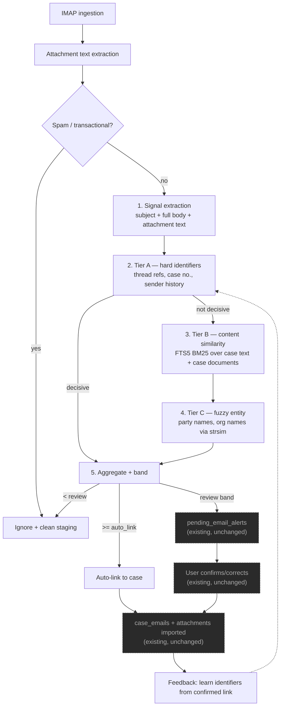

# Case Matcher — Design

Design for a **deterministic (non-LLM) email → case matcher**, the missing component in the email
classification pipeline, plus the evaluation harness needed to measure and tune it.

Companion to [`email_classification_flow.md`](./email_classification_flow.md), which documents the
pipeline as it exists today.

---

## 1. Goals and non-goals

**Goals**

1. Answer the actual product question: *which existing case does this email belong to?*
2. No LLM anywhere in the runtime matching path. Statistical + heuristic only.
3. Parse attachments and use their text as first-class matching evidence.
4. Every decision must be **explainable** — a human-readable breakdown of why a case scored what it did.
5. Measurable: `eval email generate` builds a labeled corpus, `eval email run` scores the matcher,
   thresholds are tuned from data rather than guessed.

**Non-goals — explicitly out of scope**

- **Anything frontend or Tauri-facing.** No new `#[tauri::command]`s are designed here, no React,
  no settings screens. This document covers the Rust-side classification and matching logic plus
  its evaluation harness, nothing else.
- **Email and attachment display.** Attachment staging, import into the case folder, the alert
  list, and the attachment viewer all work today and are not touched. §5.1 only *reads* files that
  ingestion has already staged to disk, to obtain text for matching — it changes nothing about how
  attachments are stored, imported, or shown.
- Removing or rewriting the LLM classification code. `emails_classify.rs`, `emails_classify_llm.rs`
  and `llm_provider_from_app` stay intact and compiling — they are simply not invoked by the default
  pipeline (see §5.9).
- Auto-creating cases from unmatched email. Unmatched mail goes to the review lane or is ignored,
  never to `INSERT INTO cases`.
- Any new external service, Python runtime, or vector database. Everything below is Rust +
  SQLite FTS5 + crates already in `Cargo.toml`.

Where the matcher inevitably meets the rest of the app — the `CaseManagementApi` seam (§6.1) and
the `pending_email_alerts` write that already exists — the design keeps the current shapes so no
caller, command, or UI needs to change.

---

## 2. What exists vs. what is missing

| Capability | Status | Location |
|---|---|---|
| IMAP fetch, MIME parse, attachment staging to disk | ✅ | `emails_ingestion.rs:108-152` |
| Spam / transactional filter | ✅ | `emails_ops.rs::is_transactional_or_spam` |
| Hebrew/English regex signal extraction | ✅ | `emails_classify_deterministic.rs` |
| FTS5 full-text index over document text, BM25 ranked | ✅ | `store/mod.rs:479-491`, `fuzzy/retrieval.rs:20-21` |
| `documents.raw_text` populated for every indexed file | ✅ | `indexer/mod.rs:265,303` (not gated by `USE_FTS_ONLY`) |
| Matcher seam: trait, `confidence`, `reason`, two-phase call | ✅ | `emails_case_api.rs` |
| Alert / human-review lane | ✅ | `emails_orchestrate.rs:255-277`, `emails_alerts.rs` |
| **Matching algorithm** | ❌ stub, always returns no-match | `emails_case_api.rs:78-90` |
| **Attachment text extraction into matching** | ❌ staged to disk, never read | — |
| **Body text into signal extraction** | ❌ only the 500-char snippet is passed | `emails_orchestrate.rs:156` |
| **Case identifier index** (case number → case, email → case) | ❌ no schema support | — |
| **Case ↔ document linkage** | ❌ inferable only from `cases.folder` path prefix | — |
| **Thread-continuity signal** (`In-Reply-To` / `References`) | ❌ headers parsed but discarded | — |
| **Case-match ground truth / eval** | ❌ eval labels `review` + `search_terms` only | `bin/eval/email/dataset.rs` |

The plumbing is largely done. The algorithm and the data it needs to run against are not.

---

## 3. Target pipeline



Everything from the band decision rightward already exists and works — alert persistence, the
alert list, user confirmation, attachment import and display. This design ends at producing a
`case_id` + `confidence` + `reason`; it changes what those values *are*, not what happens to them
afterwards. The one addition on that side is the feedback edge (`O`), which is a Rust-side hook
inside the existing confirm path.

Two structural changes from today's flow:

- **The LLM stage is replaced, not skipped.** Where step 3 used to call the LLM to enrich
  `search_terms`, it now runs content similarity and fuzzy entity matching. Tier A keeps its
  early-exit role.
- **A feedback edge.** Every confirmed link teaches the identifier index (sender address,
  party spellings, thread ids), so precision improves with use. This directly attacks the
  cold-start problem — the matcher gets better exactly where the firm gets most of its mail.

---

## 4. Data model

All additions are new tables plus one FTS5 virtual table. No destructive changes to `cases`,
`documents`, or `document_chunks`. Schema creation in this repo happens inline inside
`store::open_db_by_path` (`store/mod.rs:36`) — every table is created there with
`CREATE TABLE IF NOT EXISTS`, with `pragma_table_info` guards for added columns. The tables below
join that same batch, so any connection (app or eval) gets them automatically.

### 4.1 `case_identifiers` — the hard-match index

```sql
CREATE TABLE IF NOT EXISTS case_identifiers (
    id          INTEGER PRIMARY KEY AUTOINCREMENT,
    case_id     INTEGER NOT NULL REFERENCES cases(id) ON DELETE CASCADE,
    kind        TEXT    NOT NULL,  -- case_number|land_registry|deed|email|phone|national_id|company_id|party_name|folder_token|thread_ref
    role        TEXT,              -- optional: מאת|מקבל|עורך דין (from compound field names)
    value_norm  TEXT    NOT NULL,  -- normalized (see §5.2)
    value_raw   TEXT    NOT NULL,
    source      TEXT    NOT NULL,  -- case_fields|case_subject|case_name|folder|confirmed_email|manual
    weight      REAL    NOT NULL DEFAULT 1.0,
    created_at  TEXT    NOT NULL
);
CREATE INDEX IF NOT EXISTS idx_case_ident_lookup ON case_identifiers(kind, value_norm);
CREATE UNIQUE INDEX IF NOT EXISTS idx_case_ident_uniq ON case_identifiers(case_id, kind, value_norm);
```

This is the single highest-value addition. It turns Tier A into one indexed lookup instead of a
scan over cases.

### 4.2 `documents.case_id` — explicit case ↔ document linkage

A document belongs to a case, so the relation is a column on `documents`, not a separate link
table:

```sql
ALTER TABLE documents ADD COLUMN case_id INTEGER REFERENCES cases(id) ON DELETE SET NULL;
CREATE INDEX IF NOT EXISTS idx_documents_case ON documents(case_id);
```

Added with the existing `pragma_table_info` guard pattern used elsewhere in `store/mod.rs`.

**Nullable, deliberately.** The app indexes arbitrary folders, not only case folders — on the
audited profile 140 of 222 indexed documents sit outside any case (§10.7). `case_id IS NULL` means
"indexed but not part of a case", which is a normal state, not missing data. `ON DELETE SET NULL`
keeps a document indexed and searchable when its case is deleted.

**How it gets populated**

| Trigger | How | Typical result |
|---|---|---|
| New case created with documents | **explicit** — case is known | always set |
| `case::add_file_to_case` | **explicit** — already copies the file into the case folder | always set |
| `confirm_email_alert` attachment import | **explicit** — case is known (`emails_alerts.rs:150-165`) | always set |
| Scan & index a folder (`index_folder` / `index_file`) | **derived** — set only if the path falls under some `cases.folder` | usually NULL |
| Migration backfill | derived, one-time over existing rows | mixed |
| Case folder changed | re-derive for that case's documents | — |

Only the explicit paths guarantee a `case_id`. Scan-and-index is the common case for general
document work and normally produces NULL — that is expected, not a gap.

The derived path exists so that a file which physically lives inside a case folder gets attributed
to that case regardless of *how* it was indexed. Without it, the same file would have a `case_id`
when added through the case UI but NULL when picked up by a folder scan, and Tier B would lose most
of its corpus (82 of 222 documents on the audited profile sit under case folders but were indexed
by scanning).

Deriving from folder location still involves path matching, but it now runs **once per document at
index time** instead of per candidate case per email, and the result is stored. That difference
matters:

> **The prefix must include a trailing separator.** `folder || '%'` is wrong: a case folder named
> `…/remove-me` also matches every file under `…/remove-me2`. Measured on a real profile (§10.7),
> this attributed 17 documents to a case that owns 8, silently merging two cases' corpora. Use
> `folder || '/%'` with separators normalized first (`\` → `/`), reusing the Windows-path handling
> already in `case::lookup::parent_dir_normalized`. A path under two case folders is ambiguous and
> must leave `case_id` NULL rather than guess.

Tier B then joins directly (`WHERE d.case_id = ?`), with no path logic at match time at all.

### 4.3 `case_text_fts` — case-level searchable text

```sql
CREATE VIRTUAL TABLE IF NOT EXISTS case_text_fts USING fts5(
    subject, name, notes, field_values, identifier_values,
    tokenize = "unicode61 remove_diacritics 2"
);
```

`rowid = cases.id`. Rebuilt for a case whenever `save_case_fields`, `create_new_case`,
`update_case_status`, or annotation writes touch it. Gives the matcher a cheap way to score an
email against a case's *own* metadata, independent of whether documents were ever filed.

### 4.4 Thread reference columns

```sql
ALTER TABLE case_emails         ADD COLUMN in_reply_to TEXT;
ALTER TABLE case_emails         ADD COLUMN references_ids TEXT;  -- JSON array
ALTER TABLE pending_email_alerts ADD COLUMN in_reply_to TEXT;
ALTER TABLE pending_email_alerts ADD COLUMN references_ids TEXT;
```

`emails_ingestion.rs::extract_parts` already has the parsed headers in hand; it currently drops
`In-Reply-To` and `References`. Reply-to-a-known-case-email is the single most precise signal
available and costs one indexed lookup.

### 4.5 `case_matcher_settings` — config and migration markers

```sql
CREATE TABLE IF NOT EXISTS case_matcher_settings (
    key         TEXT PRIMARY KEY,
    value_json  TEXT NOT NULL,
    updated_at  TEXT NOT NULL
);
```

A small key/value table (the existing `user_settings` table is username-only, not generic, so it
cannot be reused). Two kinds of row:

- `key='active'` — the serialized `MatcherConfig` (§6.3). Absent on a fresh install, in which case
  `MatcherConfig::load` returns code defaults, so the matcher runs with no row present.
- `key='index_backfill_v1'` — one-time backfill marker (§6.2), following the repo's idempotent
  schema style since there is no `PRAGMA user_version` scheme in use.

---

## 5. Components

### 5.1 Attachment text extraction — `email/emails_attachments.rs` (new)

**Scope note:** this is a read-only consumer of files ingestion has *already* staged
(`emails_ingestion.rs:128-152`). Staging, the `attachments_json` format, import into the case
folder on confirm, and attachment display are unchanged — the only new behaviour is opening those
files to pull text out for matching.

```rust
pub struct AttachmentText {
    pub name: String,
    pub text: String,
    pub extracted: bool,
    pub skip_reason: Option<String>,
}

/// Extract text from every staged attachment. Never fails the pipeline —
/// unreadable attachments degrade to `extracted: false`.
pub fn extract_attachment_texts(
    attachments_json: &str,
    limits: &AttachmentLimits,
) -> Vec<AttachmentText>;

pub struct AttachmentLimits {
    pub max_files: usize,        // default 10
    pub max_bytes_per_file: u64, // default 10 MiB
    pub max_chars_total: usize,  // default 200_000
}
```

Reuses `crate::extractor::extract(path) -> Result<ExtractedFile, String>` (`extractor/mod.rs:14`),
which already handles docx / pdf / xlsx / txt — the same extractors the document indexer uses, so
attachment text is tokenized identically to case documents. Unsupported types (images, archives)
are skipped with a recorded reason rather than treated as errors.

Called from `emails_ingestion.rs` right after staging, so the text is available to the whole
pipeline. Concatenated attachment text is added to `PreparedEmail`:

```rust
pub struct PreparedEmail {
    // ... existing fields
    pub attachment_text: String,
    pub in_reply_to: Option<String>,
    pub references: Vec<String>,
}
```

### 5.2 Signal extraction — extend `emails_classify_deterministic.rs`

Three changes:

0. **Add a land-registry pattern family.** The existing pattern set (`patterns()`) covers court case
   numbers, emails, phones, national/company IDs and party names — it has **no** coverage of
   גוש / חלקה / תת-חלקה / שטר (verified: zero occurrences in the file). For conveyancing work these
   are the primary identifiers, and an email about a transaction will cite them. New patterns:

   | Signal | Matches | Emitted as |
   |---|---|---|
   | `land_registry` | `גוש 972 חלקה 11 תת חלקה 33`, `גוש 972 חלקה 11`, labeled or comma-separated | canonical composite `972/11/33` |
   | `deed` | `שטר 12345`, `שטר מס' 12345` | digits |

   `EmailExtractedSignals` gains `land_registry: Vec<String>` and `deeds: Vec<String>`, and both
   are added to `to_search_terms()` **above** party names, since they are far more selective.
   Components may appear apart or in either order, so the extractor collects גוש/חלקה/תת-חלקה
   within a bounded window and assembles the composite, emitting the partial (`972/11`) when no
   sub-parcel is present.

1. **Widen the input.** `run_email_pipeline` currently calls
   `extract_email_signals(&sender, &subject, &snippet)` (`emails_orchestrate.rs:156`) — the snippet
   is truncated to 500 chars (`emails_ingestion.rs:120-126`), so a case number in paragraph three
   is invisible today. Change to feed `subject + body_text + attachment_text`.

2. **Add a normalizer**, used for both sides of every comparison so the email and the index agree:

```rust
pub fn normalize_for_match(value: &str) -> String;
```

- lowercase, trim, collapse whitespace
- strip Hebrew geresh/gershayim `׳ ״ ' "` (matches the existing `norm_token` in
  `bin/eval/email/dataset.rs`)
- normalize Hebrew final forms: `ך→כ ם→מ ן→נ ף→פ ץ→צ`
- strip single-letter Hebrew clitic prefixes `ו ה ב ל מ כ ש` when the remainder is ≥3 chars,
  emitting **both** forms as match candidates (never replacing — prefix stripping is lossy and
  `בית` must not become `ית`)
- digits-only canonical form for case numbers, phones, national/company IDs
  (`12345/23` → `12345/23`, `05x-xxx xxxx` → `05xxxxxxxx`)

The same function builds `case_identifiers.value_norm`, so Tier A is an exact indexed lookup on
normalized values rather than fuzzy string work.

### 5.3 Case identifier builder — `case/identifiers.rs` (new)

```rust
pub fn rebuild_case_identifiers(conn: &Connection, case_id: i64) -> Result<usize, String>;
pub fn rebuild_all_case_identifiers(conn: &Connection) -> Result<usize, String>;
pub fn learn_from_confirmed_email(conn: &Connection, case_id: i64, email: &ConfirmedEmail) -> Result<(), String>;
```

Mines identifiers from case data by running the **same regex patterns** already used on emails
(`emails_classify_deterministic.rs::patterns()`) over `cases.subject`, `cases.name`,
`case_annotations.notes`, and `case_fields.field_value`. This is the key reuse: one Hebrew-aware
pattern set, applied to both sides of the match, so `תיק 12345/23` in a case subject and in an
email body normalize to the same key.

**Compound field names must be parsed, not treated as opaque.** The audited profile (§10.7) shows
`case_fields.field_name` follows a `role:field:index` convention — `מאת:ת.ז:2` (transferor's
national ID, party 2), `מקבל:שם מלא:1` (transferee's full name), `גוש ספר:1`, `עורך דין:1`. The
miner splits on `:`, maps the middle segment to a `kind`, and stores the leading segment as `role`.
This is both more reliable than regex-scanning the value and free extra signal: knowing an ID
belongs to the transferor rather than the transferee lets Tier C weight a party match by role.

Sources and default weights:

| Source | Kinds mined | Weight |
|---|---|---|
| `case_fields` name contains `גוש`/`חלקה`/`תת חלקה` | land_registry (composite) | 1.0 |
| `case_fields` name contains `שטר` | deed | 1.0 |
| `case_fields` name matches `/(תיק\|case).*(מספר\|number\|no)/i` | case_number | 1.0 |
| `case_fields` name contains `ת.ז`/`ח.פ`/`ח.צ` | national_id, company_id | 1.0 |
| `case_fields` name contains `שם מלא`/`שם פרטי`/`שם משפחה` | party_name | 0.9 |
| `case_fields` generic (value-scanned) | email, phone, national_id, company_id | 0.8 |
| `cases.subject`, `cases.name` | case_number, land_registry, party_name | 0.9 |
| `case_annotations.notes` | all | 0.6 |
| folder basename tokens | folder_token | 0.5 |
| `case_emails` sender/recipient (confirmed) | email, thread_ref | 1.0 |

Land-registry components are mined per party/index group and assembled into the canonical composite
(`gush/helka/tat`, §5.5 Tier A) before storage, so `גוש ספר:1 = 972` and `חלקה דף:1 = 11` become a
single `land_registry` identifier `972/11` rather than two weak numeric fragments.

`learn_from_confirmed_email` is called from `confirm_email_alert` — this is the feedback edge in §3.

### 5.4 Document → case assignment — `case/documents_link.rs` (new)

Sets `documents.case_id` (§4.2). Small module — the relation is a column, so there is no link table
to maintain.

```rust
/// Derive and set case_id for one document. Returns the assigned case, if any.
pub fn assign_document_case(conn: &Connection, document_id: i64) -> Result<Option<i64>, String>;
/// Re-derive for every document under a case's folder (call when the folder changes).
pub fn reassign_documents_for_case(conn: &Connection, case_id: i64) -> Result<usize, String>;
/// One-time migration backfill over all documents.
pub fn backfill_document_case_ids(conn: &Connection) -> Result<usize, String>;
```

Path resolution reuses the normalization already written for
`case::lookup::resolve_case_for_parent` (`case/lookup.rs:101-117`), including its Windows-path
handling and its "ambiguous → None" rule — a file under two case folders leaves `case_id` NULL.

`case::add_file_to_case` and `confirm_email_alert` do not need derivation at all: both already know
the target case and copy the file into its folder, so they set `case_id` directly.

### 5.5 The matcher — `email/case_matcher/` (new module)

```
case_matcher/
├── mod.rs          — CaseMatcher, match_email_core, orchestration
├── tier_a.rs       — hard identifier lookups
├── tier_b.rs       — FTS5/BM25 content similarity
├── tier_c.rs       — fuzzy entity similarity
├── scoring.rs      — weighted aggregation, bands, ambiguity guard
└── explain.rs      — human-readable reason construction
```

**Critical design constraint: the core is `AppHandle`-free.**

```rust
/// Pure core — takes a Connection, no Tauri handle. Testable and eval-runnable headless.
pub fn match_email_core(
    conn: &Connection,
    request: &CaseMatchRequest,
    config: &MatcherConfig,
) -> Result<CaseMatchOutcome, String>;
```

`CaseManagementApi::match_email(&self, app, request)` becomes a thin wrapper that opens the DB and
delegates. This mirrors the decoupling already done for document search
(`tests/decoupled_pipeline_test.rs`) and is what makes the eval harness possible at all — the
current trait signature requires an `AppHandle`, which is why `emails_orchestrate.rs`'s own tests
can't call it (`emails_orchestrate.rs:362`).

#### Tier A — hard identifiers (`tier_a.rs`)

Ascurix serves **both litigation and real-estate conveyancing**, and the two practice areas
identify a matter completely differently. A litigation case is keyed by a court case number; a
conveyancing matter has no case number at all and is keyed by the property's land-registry
coordinates and the parties' national IDs. A P0 audit of a real profile (§10.7) found **zero**
court case numbers and 30 populated `ת.ז` fields — so a matcher that leads with `case_number` would
never fire on half the product's workload.

Tier A is therefore organized by **identifier precision**, not by practice area. Each signal is an
indexed lookup against `case_identifiers`; a case only needs to carry *one* family.

| Signal | Lookup | Score | Decisive |
|---|---|---|---|
| A0 Thread reference | `in_reply_to`/`references` ∈ `case_emails.message_id` | 1.00 | yes |
| A1 Court case number | `kind='case_number'` | 0.95 | yes |
| A2 Land-registry key, full | `kind='land_registry'`, גוש+חלקה+תת-חלקה | 0.95 | yes |
| A3 Deed number | `kind='deed'` (שטר) | 0.90 | yes |
| A4 Land-registry key, partial | גוש+חלקה (no sub-parcel) | 0.75 | conditional |
| A5 National / company ID | `kind IN ('national_id','company_id')` | 0.85 | conditional |
| A6 Sender address, confirmed history | `kind='email' AND source='confirmed_email'` | 0.60 | no |
| A7 Sender address, case metadata | `kind='email'` other sources | 0.50 | no |
| A8 Phone number | `kind='phone'` | 0.45 | no |

**Land-registry composite keys.** גוש (block) alone identifies an area containing many properties
and must never be decisive on its own — it is stored but scored near zero in isolation.
גוש+חלקה narrows to one parcel; adding תת-חלקה identifies a specific unit. `value_norm` for
`kind='land_registry'` is therefore the **canonical composite** `gush/helka/tat` with missing
components omitted (`972/11`, `972/11/33`), and lookups match on the longest available prefix.
A partial (A4) match is decisive only when it resolves to exactly one case.

**Conditional decisiveness** (A4, A5): decisive only if the lookup resolves to exactly one case.
A national ID legitimately spans several matters for the same client, and one parcel can be sold
twice. When it resolves to several, do not early-exit — fall through to Tiers B/C and let the
ambiguity guard (§5.6) handle it.

"Decisive" always carries the same precondition: exactly one case matches. Multiple hits on any
decisive signal fall through rather than early-exit.

A6–A8 are non-decisive by design: opposing counsel emails about many matters, so sender alone must
never auto-link. It contributes a prior that content similarity then confirms.

"Decisive" means: if exactly one case matches, return immediately with that confidence and skip
Tiers B/C. If *several* cases match a decisive signal, do not early-exit — fall through and let
Tiers B/C disambiguate, which is what the ambiguity guard (§5.6) is for. A2 is decisive only when
the ID belongs to exactly one case, since one client can have several matters.

A3–A5 are non-decisive by design: a regular opposing counsel emails about many cases, so sender
alone must never auto-link. It contributes a prior that content similarity then confirms.

#### Tier B — content similarity (`tier_b.rs`)

Replaces Gemini's TF-IDF + cosine step with BM25 over indexes that already exist and are already
maintained by triggers.

```rust
pub struct ContentScores {
    pub per_case: HashMap<i64, ContentScore>,
}
pub struct ContentScore {
    pub case_text_score: f32,   // from case_text_fts
    pub document_score: f32,    // from documents_fts, filtered by documents.case_id
    pub matched_terms: Vec<String>,
    pub top_documents: Vec<(i64, f32)>,
}
```

Query construction reuses `fuzzy::tokens::{exact_term, prefix_term}` and the tiered
exact→prefix→LIKE fallback strategy proven in `fuzzy/retrieval.rs`:

1. Build the term set from `search_terms` (already produced by `to_search_terms()`) plus salient
   tokens from subject/body/attachment text (stopword-filtered, length ≥ 3, capped at ~40 terms).
2. `SELECT rowid, rank FROM case_text_fts WHERE case_text_fts MATCH ?1` → per-case score.
3. `SELECT d.case_id, d.id, fts.rank FROM documents_fts fts JOIN documents d ON d.id = fts.rowid`
   `WHERE d.case_id IS NOT NULL` → group by `d.case_id`, take the top-K documents per case (K=5)
   and sum their normalized ranks.
   Grouping after retrieval means one FTS query serves all cases — no per-case corpus scan.
4. Normalize SQLite's BM25 `rank` (negative, lower = better) to 0..1 via
   `1.0 - (rank / worst_rank_in_result_set)`, so scores are comparable across queries of different
   term counts.

Both scores are capped and blended: `content = 0.6 * case_text + 0.4 * document`. Case-level text
is weighted higher because it is reliably present, whereas document linkage depends on the user
actually filing documents into case folders.

#### Tier C — fuzzy entity (`tier_c.rs`)

Catches spelling drift that FTS misses (`מזרחי` / `מזרחי-כהן`, transliteration variants).

```rust
pub fn score_party_similarity(
    email_parties: &[String],
    case_parties: &[String],  // kind='party_name' from case_identifiers
) -> f32;
```

Uses `strsim` (already a dependency, already used by `fuzzy/scoring.rs`) — Jaro-Winkler on
normalized forms, best-pair matching, threshold 0.85 to count as a hit. Capped contribution so a
common surname cannot dominate.

### 5.6 Aggregation, bands, ambiguity guard (`scoring.rs`)

```rust
pub struct CaseCandidate {
    pub case_id: i64,
    pub confidence: f64,
    pub signals: Vec<SignalContribution>,
}
pub struct SignalContribution {
    pub tier: &'static str,
    pub name: &'static str,
    pub raw: f32,
    pub weighted: f32,
    pub detail: String,
}
pub struct CaseMatchOutcome {
    pub best: Option<CaseCandidate>,
    pub runners_up: Vec<CaseCandidate>,
    pub band: MatchBand,
    pub explanation: String,
}
pub enum MatchBand { AutoLink, Review, Ignore }
```

Aggregation is a weighted sum, clamped to `[0,1]`:

```
confidence = clamp(
    w_thread   * thread_ref
  + w_case_no  * case_number
  + w_ids      * id_match
  + w_sender   * sender_match
  + w_phone    * phone_match
  + w_content  * content_score
  + w_party    * party_similarity
)
```

**Ambiguity guard.** After ranking, if `best.confidence - runner_up.confidence < ambiguity_margin`
(default 0.15), the band is demoted from `AutoLink` to `Review` regardless of absolute score, and
both candidates are surfaced. Silently auto-linking to the wrong matter is far more damaging in a
legal product than asking the user — this rule encodes that asymmetry.

**Bands** (defaults, to be tuned by §7.4, not assumed):

| Band | Condition | Action |
|---|---|---|
| `AutoLink` | `confidence ≥ 0.85` and not ambiguous | link to `case_emails` directly |
| `Review` | `0.45 ≤ confidence < 0.85`, or ambiguous | `pending_email_alerts` with suggestion |
| `Ignore` | `confidence < 0.45` | `ignored_emails` |

`AutoLink` should ship **disabled** (`auto_link_enabled: false`, everything ≥0.45 → Review) until
eval on real mail justifies turning it on.

### 5.7 Explanation (`explain.rs`)

`CaseMatchResult.reason` already exists and is already persisted to
`pending_email_alerts.reason`. No schema or display change is needed — the field simply gets a
structured, readable value instead of the stub's placeholder text:

```
Matched case #42 (confidence 0.91)
  ✓ case number      12345/23 found in subject          +0.45
  ✓ sender known     adv.cohen@lawfirm.co.il (confirmed) +0.18
  ✓ content          3 case documents matched: כתב תביעה, פרוטוקול +0.21
  ~ party name       "מזרחי" ≈ "מזרחי-כהן" (0.89)        +0.07
  runner-up: case #17 (0.31)
```

This is the explainability advantage of the heuristic approach, and it is also the debugging and
tuning surface — without it, choosing weights is guesswork. It is consumed by the eval reports
(§7.3) regardless of whether anything ever renders it.

### 5.8 Wiring into the pipeline

`run_email_pipeline` changes shape:

```rust
pub enum PipelineStopStage {
    IgnoredSpam,
    HardCaseMatch,        // was DeterministicCaseMatch
    ContentCaseMatch,     // replaces AfterLlmCaseMatch
    NoCaseMatch,
    LlmSkippedNoProvider, // retained, only reachable in llm_assisted mode
    LlmIgnoredNotForReview,
}
```

`CaseMatchPhase` gains a `Content` variant; `AfterLlm` is retained for the dormant path.

### 5.9 What happens to the LLM code

Per requirement 1, nothing is deleted. The pipeline mode becomes explicit config:

```rust
pub enum EmailPipelineMode {
    Deterministic,  // default — Tiers A/B/C only, no LLM
    LlmAssisted,    // existing behaviour: LLM enrichment between Tier A and Tier B
}
```

Stored in `case_matcher_settings`. In `Deterministic` mode `llm_provider_from_app` is never called,
so email ingestion makes zero LLM requests and incurs zero cost. `emails_classify.rs`,
`emails_classify_llm.rs`, the `BackendOnline` wiring, and their tests all remain compiled and
callable — the mode switch is the only thing standing between them and the pipeline. This also
means the untested backend-online classification path (see AMI-75) stops being on the critical
path for email ingestion.

---

## 6. Key interfaces

### 6.1 Matcher entry point

```rust
// email/case_matcher/mod.rs
pub struct CaseMatcher { config: MatcherConfig }

impl CaseMatcher {
    pub fn new(config: MatcherConfig) -> Self;
    pub fn match_email_core(&self, conn: &Connection, req: &CaseMatchRequest)
        -> Result<CaseMatchOutcome, String>;
}

// email/emails_case_api.rs — replaces StubCaseManagementApi as the registered impl
pub struct LocalCaseMatcherApi;

impl CaseManagementApi for LocalCaseMatcherApi {
    fn match_email(&self, app: &AppHandle, request: &CaseMatchRequest)
        -> Result<CaseMatchResult, String>
    {
        let conn = crate::store::open_db(app)?;
        let config = MatcherConfig::load(&conn)?;
        let outcome = CaseMatcher::new(config).match_email_core(&conn, request)?;
        Ok(outcome.into_case_match_result())
    }
}

pub fn resolve_case_api(_app: &AppHandle) -> &dyn CaseManagementApi {
    static API: LocalCaseMatcherApi = LocalCaseMatcherApi;
    &API
}
```

`CaseMatchRequest` / `CaseMatchResult` keep their current shape — the seam was designed correctly
and needs no breaking change. `CaseMatchRequest` gains `attachment_text`, `body_text`,
`in_reply_to`, `references`.

This is the **only** point where the matcher touches Tauri, and it is an existing seam — the trait,
its registration function, and the request/response types are all already in
`emails_case_api.rs`. The change is swapping which implementation `resolve_case_api` returns.

### 6.2 Index maintenance — no commands required

The derived data (`case_identifiers`, `documents.case_id`, `case_text_fts`) must be populated
for the matcher to work at all, so it is worth being precise about what triggers them. **Every
trigger is an internal Rust call from code that already runs.** No `#[tauri::command]` is needed for
classification to function:

| Index | Rebuilt when | Hook site (existing code) |
|---|---|---|
| `case_identifiers`, `case_text_fts` | case created / fields saved / notes edited | `case::create_new_case`, `case::save_case_fields`, annotation writes |
| `documents.case_id` | document indexed / added to a case / case folder changed | `indexer::index_file_core_impl`, `case::add_file_to_case`, `confirm_email_alert` |
| `case_identifiers` (learned) | email confirmed to a case | `confirm_email_alert` (`emails_alerts.rs`) |
| all three | one-time backfill on existing installs | `store::open_db_by_path`, guarded (below) |

**Backfill on existing installs.** A profile that already has cases and documents starts with all
three indexes empty, so a one-time population is required. The repo has no `PRAGMA user_version`
scheme — schema is idempotent `CREATE TABLE IF NOT EXISTS` plus `pragma_table_info` guards — so the
backfill follows the same style with a marker row:

```rust
// in the open_db_by_path schema batch, after the new tables are created
if !matcher_marker_set(&conn, "index_backfill_v1") {
    rebuild_all_case_identifiers(&conn)?;
    backfill_document_case_ids(&conn)?;
    rebuild_all_case_text_fts(&conn)?;
    set_matcher_marker(&conn, "index_backfill_v1")?;
}
```

Marker rows live in `case_matcher_settings` (§4.5) alongside the config. Bumping the suffix
(`_v2`) re-runs the backfill after a scoring change that needs different identifiers — the whole
mechanism is one `SELECT` on an already-open connection.

Because backfill can be slow on a large profile (see §10.6), it should run off the open path in a
background task and set the marker only on success; a partially built index is safe (the matcher
simply scores lower) but must not be marked done.

**Deliberately not designed here** — these were considered and are *not* required for
classification:

| Candidate | Why it is not needed |
|---|---|
| `rebuild_case_index` command | The incremental hooks plus the guarded backfill cover every population path. A manual trigger is only useful for recovery after index drift or a bulk reindex — an ops convenience, not a classification requirement. |
| `explain_case_match` | The explanation string is built by `explain.rs` and persisted to the existing `pending_email_alerts.reason` column on every match. Nothing extra is needed to produce or store it. |
| `get_matcher_settings` / `save_matcher_settings` | `MatcherConfig::load(conn)` returns code defaults when no row exists. Thresholds tuned by the eval sweep (§7.4) ship as new defaults in code. A settings surface is only needed if end users should tune weights themselves. |
| `rematch_pending_alerts` | Not needed for incoming mail. It does have real value at cold start — once a few emails are confirmed, the identifier index improves and older unmatched alerts would now match — but that can run internally at the end of an ingestion cycle rather than as a user action. |

If any of these later turn out to be wanted, each is a thin wrapper over a function this design
already specifies; none would change the matcher.

### 6.3 `MatcherConfig`

```rust
pub struct MatcherConfig {
    pub mode: EmailPipelineMode,
    pub weights: SignalWeights,
    pub auto_link_threshold: f64,   // 0.85
    pub review_threshold: f64,      // 0.45
    pub ambiguity_margin: f64,      // 0.15
    pub auto_link_enabled: bool,    // false until eval says otherwise
    pub top_documents_per_case: usize, // 5
    pub max_terms: usize,           // 40
    pub attachment_limits: AttachmentLimits,
}
```

Serialized to `case_matcher_settings`, with `Default` matching the tables above.

---

## 7. Evaluation

The existing `eval email` harness measures the LLM's `review` boolean and `search_terms` recall. It
cannot measure case matching, because there is no case ground truth and no case corpus. This
section adds both.

### 7.1 `eval email generate` — synthetic case + email corpus

Today `generate.rs` copies a fixture file. It becomes a real corpus generator.

```bash
cargo run --bin eval --manifest-path apps/desktop/src-tauri/Cargo.toml \
  email generate --corpus-dir ./email_eval_corpus \
  --cases 30 --emails 200 --with-attachments --seed 42
```

```rust
pub struct GenerateArgs {
    pub corpus_dir: String,
    #[arg(long, default_value = "30")]  pub cases: usize,
    #[arg(long, default_value = "200")] pub emails: usize,
    #[arg(long)] pub with_attachments: bool,
    #[arg(long, default_value = "42")] pub seed: u64,
    #[arg(long, default_value = "0.25")] pub unrelated_ratio: f64,
    #[arg(long, default_value = "0.4")]  pub decoy_share: f64,
    #[arg(long, default_value = "he")] pub lang: String,  // he|en|mixed
}
```

Output layout:

```
email_eval_corpus/
├── cases/
│   ├── case_001/                       ← becomes cases.folder
│   │   ├── כתב_תביעה.docx
│   │   ├── פרוטוקול_דיון.docx
│   │   └── חוזה.txt
│   └── ...
├── attachments/                        ← files referenced by email fixtures
├── cases.json                          ← case metadata: subject, name, fields, parties
├── email_matching_dataset.json         ← the labeled emails
└── email_classification_dataset.json   ← existing LLM fixture set, preserved
```

`email_matching_dataset.json` entries:

```json
{
  "id": "em_014",
  "sender": "adv.cohen@lawfirm.co.il",
  "sender_name": "עו״ד כהן",
  "subject": "עדכון בתיק 12345/23 — דיון בתאריך 12/03",
  "body_text": "...",
  "in_reply_to": "<prev@example.com>",
  "references": ["<root@example.com>"],
  "attachments": [{ "name": "כתב_תביעה.docx", "path": "attachments/em_014_1.docx" }],
  "expected": {
    "case_id": 12,
    "difficulty": "easy",
    "signal": "case_number",
    "band": "AutoLink"
  }
}
```

Generation must produce a **difficulty spread**, because a corpus of only case-number emails would
report 100% and prove nothing:

| Difficulty | Share | Construction |
|---|---|---|
| `easy` | 25% | explicit case number in subject |
| `medium` | 25% | no case number; known sender + shared vocabulary with case documents |
| `hard` | 25% | party names only, with deliberate spelling variants; vocabulary drift from case docs |
| `thread` | 10% | reply referencing a prior confirmed email |
| `unrelated` | 15%* | marketing, OTP, billing — `expected.case_id: null` |
| `decoy` | 10%* | business-like mail belonging to no case — see below |
| `adversarial` | — | near-miss: mentions a party shared by **two** cases → expected band `Review`, not `AutoLink` |

*`--unrelated-ratio` sizes the not-case-related budget; `--decoy-share` splits it between obvious
spam and decoys.

**Why the decoy slice exists.** `is_transactional_or_spam` runs *before* the matcher
(`emails_orchestrate.rs:146`). Measured against the real 52-keyword blocklist, roughly two thirds of
obvious spam never reaches the matcher at all, and what survives shares no vocabulary with any case,
so it scores zero for free — a false-positive metric built only on spam is close to a free pass.
Decoys are business-like: a plausible sender unknown to every case, genuine legal vocabulary drawn
from the case topics, and in ~45% of them a **near-miss identifier** — the same `גוש` with a parcel
nobody owns, or a case number one digit off. Those are what Tier B can wrongly link, and what the
partial land-registry rule (§5.5 A4) and the ambiguity guard exist to reject. Together with the
adversarial slice they are the main defense against a matcher that looks good on paper and mislinks
in practice.

Hebrew and English variants are generated per `--lang`, since the whole point of the normalizer is
Hebrew handling.

### 7.2 `eval email run --mode matcher`

```bash
cargo run --bin eval --manifest-path apps/desktop/src-tauri/Cargo.toml \
  email run --corpus-dir ./email_eval_corpus --mode matcher
```

```rust
pub enum EvalMode { Matcher, Classification, Full }
```

- `matcher` — no LLM at all. This is the new default and the one that answers requirement 4.
- `classification` — existing LLM `review`/`search_terms` eval, unchanged.
- `full` — pipeline end-to-end in `LlmAssisted` mode, for comparing modes.

Runner (`bin/eval/email/matcher_run.rs`, new):

1. Create a scratch SQLite DB (`email_eval_index.db`) via `store::open_db_by_path` — schema is
   created inline by that call, so no separate migration step is needed.
2. Load `cases.json` → insert cases; index every file under `cases/` with the existing
   `indexer::index_file_core(db_path, provider, file_path, options, reindex)`
   (`indexer/mod.rs:165`) using `LlmProvider::Mock` → populates `documents` + `documents_fts`.
3. Run `rebuild_all_case_identifiers`, `backfill_document_case_ids`, `rebuild_all_case_text_fts`.
4. For each fixture: extract attachment text, build a `CaseMatchRequest` exactly as the pipeline
   would, call `match_email_core` — **the same code path the app runs**, no reimplementation.
5. Score against `expected`.

Both entry points this depends on are already `AppHandle`-free: `index_file_core` takes a
`&Path` to the DB (the document eval CLI uses it the same way), and `match_email_core` takes a
`&Connection` by design (§5.5). So the harness runs headless with no Tauri runtime. That
decoupling of the matcher is a prerequisite for the whole harness, not an incidental cleanup —
the current `CaseManagementApi::match_email` signature requires an `AppHandle`, which is exactly
why `emails_orchestrate.rs`'s own tests cannot call it today (`emails_orchestrate.rs:362`).

### 7.3 Metrics

```rust
pub struct MatcherEvalSummary {
    pub total: usize,
    pub accuracy_at_1: f64,
    pub precision: f64,
    pub recall: f64,
    pub f1: f64,
    pub mrr: f64,
    pub mislink_rate: f64,          // wrong case auto-linked — the critical metric
    pub band_confusion: BandConfusion,
    pub per_difficulty: HashMap<String, DifficultyStats>,
    pub per_signal: HashMap<String, SignalStats>,
    pub failures: Vec<FailureDetail>,
}
```

| Metric | Why |
|---|---|
| **Mislink rate** | Auto-linked to the *wrong* case. Treat as the hard gate — this is the only failure the user cannot easily undo. Target 0. |
| Accuracy@1 | Top candidate is the correct case |
| Precision / recall / F1 | Standard, computed over matched-vs-unmatched |
| MRR | Rewards ranking the right case highly even when below threshold |
| Band confusion | 3×3 matrix of expected vs. actual band; catches over-eager `AutoLink` |
| Per-difficulty | Where the matcher breaks down (expect `hard` to be the weak spot) |
| Per-signal | Which signal carried each correct match — feeds weight tuning |

Exit codes mirror the existing convention (`run.rs:98-115`): any mislink or `hard` regression fails
the run; false positives in the `Review` band warn only.

### 7.4 Threshold sweep and ablation

This is what makes the weights defensible rather than invented.

```bash
eval email run --corpus-dir ./c --mode matcher --sweep
eval email run --corpus-dir ./c --mode matcher --ablate content
```

- `--sweep` grid-searches `auto_link_threshold` × `review_threshold` × `ambiguity_margin`,
  reports the F1-optimal and the **mislink-free** operating point (the one to ship), and can write
  the winner into `case_matcher_settings` via `--apply`.
- `--ablate <signal>` disables one signal and re-runs, quantifying its marginal contribution.
  If a signal's ablation delta is ~0, it is dead weight and should be dropped.

### 7.5 History — `list` / `show` / `compare`

Reuses the `evaluation_history.db` pattern from the document eval (see
[`docs/evaluation/pr4_eval_history.md`](../evaluation/pr4_eval_history.md)), with a new
`email_matcher_runs` table storing config snapshot + metrics per run, so weight changes are
comparable over time:

```bash
eval email list
eval email show <run_id>
eval email compare <run_a> <run_b>
```

`compare` diffs per-difficulty and per-signal stats, so a change that improves `easy` while
regressing `hard` is visible rather than hidden behind an aggregate.

### 7.6 Unit and integration tests

| Test | Location |
|---|---|
| Normalizer: Hebrew finals, geresh, clitic prefixes, ID canonicalization | `emails_classify_deterministic.rs` (inline, alongside existing 8) |
| Identifier mining from case fields/subject/notes | `case/identifiers.rs` (inline) |
| Tier A: exact/ambiguous/no-match per signal | `tests/email/matcher_tier_a.rs` (new) |
| Tier B: BM25 grouping, normalization, top-K | `tests/email/matcher_tier_b.rs` (new) |
| Scoring: band boundaries, ambiguity guard demotion | `case_matcher/scoring.rs` (inline) |
| Attachment extraction: unsupported type, oversize, corrupt | `tests/email/attachments.rs` (new) |
| End-to-end on a small fixed corpus | `tests/email/matcher_e2e.rs` (new) |

Per the repo's 80/20 testing rule: main flow plus the failure modes that matter (ambiguity,
unreadable attachment, empty case index), not exhaustive edge coverage.

---

## 8. Component summary

**Pipeline**

| # | Component | File | New? |
|---|---|---|---|
| 1 | Attachment text extraction | `email/emails_attachments.rs` | new |
| 2 | Header capture (`In-Reply-To`, `References`) | `email/emails_ingestion.rs` | edit |
| 3 | Match normalizer | `email/emails_classify_deterministic.rs` | edit |
| 4 | Signal extraction over full body + attachments | `email/emails_orchestrate.rs` | edit |
| 5 | Case identifier builder | `case/identifiers.rs` | new |
| 6 | Case ↔ document linker | `case/documents_link.rs` | new |
| 7 | Case text FTS index | `store/mod.rs` | edit |
| 8 | Tier A — hard identifiers | `email/case_matcher/tier_a.rs` | new |
| 9 | Tier B — BM25 content | `email/case_matcher/tier_b.rs` | new |
| 10 | Tier C — fuzzy entity | `email/case_matcher/tier_c.rs` | new |
| 11 | Scoring / bands / ambiguity guard | `email/case_matcher/scoring.rs` | new |
| 12 | Explanation builder | `email/case_matcher/explain.rs` | new |
| 13 | `LocalCaseMatcherApi` | `email/emails_case_api.rs` | edit |
| 14 | Pipeline mode switch | `email/emails_orchestrate.rs` | edit |
| 15 | Feedback learning on confirm | `email/emails_alerts.rs` | edit |
| 16 | Migrations + settings table | `store/mod.rs` | edit |

**Eval**

| # | Component | File | New? |
|---|---|---|---|
| 17 | Corpus + ground-truth generator | `bin/eval/email/generate.rs` | rewrite |
| 18 | Synthetic case/document/email builders | `bin/eval/email/corpus.rs` | new |
| 19 | Matcher runner | `bin/eval/email/matcher_run.rs` | new |
| 20 | Matcher metrics + report | `bin/eval/email/matcher_metrics.rs` | new |
| 21 | Threshold sweep / ablation | `bin/eval/email/sweep.rs` | new |
| 22 | Run history persistence | `bin/eval/email/history.rs` | new |
| 23 | `list` / `show` / `compare` | `bin/eval/email/{list,show,compare}.rs` | edit/new |
| 24 | Mode dispatch (`--mode matcher`) | `bin/eval/email/run.rs`, `mod.rs` | edit |

---

## 9. Suggested phasing

Each phase leaves the tree compiling and independently useful.

| Phase | Contents | Exit criterion |
|---|---|---|
| **P1 — Data foundations** | Migrations (§4), identifier builder, document linker, case text FTS, `rebuild_case_index` command | `rebuild_case_index` populates all three indexes on a real profile |
| **P2 — Attachments + signals** | `emails_attachments.rs`, header capture, normalizer, full-body extraction | Attachment text visibly reaches `CaseMatchRequest` |
| **P3 — Eval scaffolding** | Generator, corpus builders, headless runner against a *stub* matcher | `eval email generate` + `run --mode matcher` execute and report 0% — baseline established |
| **P4 — Matcher Tier A** | `match_email_core`, Tier A, scoring, bands, explain, `LocalCaseMatcherApi` | `easy` + `thread` difficulties pass; mislink rate 0 |
| **P5 — Matcher Tiers B/C** | BM25 content, fuzzy entity, ambiguity guard | `medium` passes; `hard` measurably above baseline |
| **P6 — Tuning + feedback** | Sweep, ablation, history, feedback learning on confirm | Shipped thresholds derived from sweep, not defaults |

Building eval (P3) *before* the matcher (P4/P5) is deliberate: without a baseline you cannot tell
whether Tier B is helping or whether a weight change was an improvement.

---

## 10. Risks and open questions

1. **Folder discipline.** ~~Speculative~~ — **measured, §10.7.** All 9 cases on the audited
   profile have 5–21 documents under their folder, so Tier B's document half is viable. Keep the
   0.6 case-text / 0.4 document blend. Re-check on a customer profile before P5 finalizes weights:
   `SELECT COUNT(*) FROM documents WHERE case_id IS NOT NULL` after backfill.

2. **Cold start.** A fresh install has no confirmed emails, so A3 (sender history) and thread refs
   contribute nothing, and the matcher runs on case numbers + content alone. Expected and
   acceptable — but eval should report metrics both with and without the learned signals so the
   day-one experience is known, not just the steady state.

3. **Hebrew tokenization in FTS5.** `unicode61` splits Hebrew on non-letters but does no
   morphological analysis; clitic prefixes are handled by emitting both token forms at query time
   (§5.2), which increases recall at some precision cost. If eval shows this hurting, the fallback
   is a custom tokenizer — significantly more work, so measure first.

4. **`case_fields` is template-driven.** ~~Speculative~~ — **measured, §10.7.** The audited
   templates define no case-number field at all, but do define land-registry and party-ID fields
   with a `role:field:index` naming convention. Identifier mining is therefore driven primarily by
   field *names* (§5.3), with value regexes as backstop. Firms with unusual templates may still
   need the `manual` identifier source.

5. **Case number collisions.** Court case numbers (`12345/23`) are not globally unique across
   courts. Two cases can legitimately share one. The ambiguity guard covers this, but if collisions
   are common, `case_identifiers` may need a court/jurisdiction qualifier.

6. **Migration cost.** `backfill_document_case_ids` re-scans every document path and the FTS rebuild
   touches every case.
   On a large profile this should run once, in background, with progress — not synchronously on
   first launch after update.

7. **P0 audit — measured findings.** Run against a real profile
   (`documents.db`, 9 cases / 222 documents) before implementation:

   | Question | Finding |
   |---|---|
   | Documents under case folders? | **Yes** — all 9 cases have 5–21 docs; 82/222 documents total. Tier B document half viable. |
   | Court case numbers in case data? | **Zero.** 0 cases have `\d+/\d+` in subject or name; 3 field values match and appear to be dates. |
   | What identifies a matter instead? | `ת.ז` national IDs (30 populated), `גוש ספר`/`חלקה דף`/`תת חלקה` land-registry keys, `שטר` deed numbers, party names. |
   | Field naming | Compound `role:field:index` (`מאת:ת.ז:2`, `מקבל:שם מלא:1`). |
   | Regex coverage for land registry | **None** — `emails_classify_deterministic.rs` has zero occurrences of `גוש`/`חלקה`/`שטר`. Added in §5.2. |
   | Folder prefix join | **Bug found.** `folder || '%'` attributed 17 documents to a case owning 8 (`remove-me` swallowed `remove-me2`). Fixed in §4.2. |

   **Caveat on representativeness.** This is a developer profile with 9 cases and visible test data
   (`sss`, `aaa`, `fffffffff`). Trustworthy: which field types the templates define, the absence of
   a case-number field, the compound naming convention, and the join bug — these reflect template
   and code design, not data entropy. Not trustworthy: any count, distribution, or per-case average.
   Ascurix targets **both litigation and conveyancing**, so Tier A carries both identifier families
   (§5.5) and must work for cases that have only one.

---

### 10.8 P6 sweep result — the defaults survive

`eval email run --mode matcher --sweep` grid-searches `review_threshold` × `content` weight ×
`ambiguity_margin` (144 points) over the seed-42 corpus (30 cases, 200 emails), re-scoring cached
tier contributions rather than re-running the matcher.

Baseline recorded as run 11 (`eval email show 11`, label `p6-swept-defaults`).

**Outcome: no mislink-free point beats the shipped defaults.** They stand unchanged —
`review_threshold` 0.45, `content` 0.70, `ambiguity_margin` 0.15 — but as a measured result rather
than an informed guess, which is what the P6 exit criterion asked for.

| Operating point | accuracy@1 | F1 | mislinks |
|---|---|---|---|
| Shipped defaults | 78.0% | 0.88 | **0** |
| F1-optimal (review 0.25, content 1.00) | 92.7% | 0.94 | 8 |

The F1 optimum is not shippable: mislinking is a constraint, not a term in the objective. Nothing
sits between `review_threshold` 0.40 and 0.45, and the first threshold that admits anything new
(0.35) admits 2 correct matches and 3 wrong ones.

**`hard` therefore stays at 0/33.** Tier B ranks 22 of the 33 first (MRR 0.95), so the ranking is
sound and the gap is calibration: content-only confidences (0.20–0.40) overlap the decoy population
in the same range. Separating them needs a better content score, not a different threshold —
candidates are phrase/proximity scoring, per-case length normalization, or an embedding signal.
Recorded here rather than resolved, since P6's job was to find the operating point, and it did.

### 10.9 Ablation — no dead signals, but heavy redundancy

`--ablate` measures each signal twice: **marginal** (accuracy lost by removing it, all others
present) and **solo** (accuracy it reaches alone). Both are needed. Marginal alone would have
labelled `case_number` dead weight, when in fact it reaches 20% by itself and is merely covered by
other identifiers on this corpus.

| Signal | marginal | solo |
|---|---|---|
| `sender_metadata` | 0.0 | 70.0% |
| `case_number`, `national_id` | 0.0 | 20.0% |
| `land_registry` | 0.0 | 14.7% |
| `thread_ref` | 0.0 | 10.0% |
| `deed`, `land_registry_partial` | 0.0 | 6.7% |
| `content` | **+8.0** | 0.7% |
| `party_name` | **+8.0** | 0.0% |

No signal is dead, so none is deleted. `content` and `party_name` are the only ones with a non-zero
marginal — they are what P5 added, and each is worth 8 accuracy points. `party_name` reaching 0%
solo while contributing 8 points marginally is the clearest evidence that the tiers are
complementary rather than duplicative.

### 10.10 Cold start vs. steady state

`--cold-start` re-scores with the signals that can only exist after a confirmation removed
(`thread_ref`, `sender_confirmed`). Day one and steady state both come out at **78.0%** on this
corpus.

That is a corpus limitation, not a finding about the product: the generator gives thread replies a
quoted case number, so they match on an identifier even with `thread_ref` gone. A corpus with
identifier-free thread replies would separate the two numbers. Recorded so the equality is not
mistaken for evidence that confirmations do not matter — §10.2 still applies.

### 10.11 First run against real mail — two calibration failures

`eval email real`, 130 emails over 30 days from the configured Gmail account, matched
against the live profile (9 active cases, 76 identifiers, 82 documents linked to a case).
Migrations and backfill ran clean on real data for the first time. The matcher's behaviour
did not survive contact.

**1. Real emails are ~30× longer than the corpus generates.**

| | median | mean | p90 |
|---|---|---|---|
| Synthetic corpus | 68 chars | 73 | 106 |
| Real mail | 2,077 chars | 4,210 | 13,340 |

Tier B scores by IDF-weighted *coverage* — matched weight over the query's total weight.
Real mail carries signatures, disclaimers, quoted reply chains and legal boilerplate, so
the denominator explodes while the matching terms do not. Measured `content` contribution
on real mail was **0.02–0.03**, against 0.30–0.50 on the corpus. Tier B is effectively
inert in production, and every conclusion drawn about it — including its +8.0 ablation
marginal — is an artefact of unrealistically short synthetic emails.

Fixing this is a scoring change, not a threshold change: coverage has to be robust to
irrelevant text. Candidates are scoring against the best-matching *window* rather than the
whole email, stripping quoted/boilerplate blocks before tokenizing, or replacing coverage
with a saturating sum of matched IDF that never divides by the query length.

**2. The strongest signal has nothing to bind to.**

Identifier kinds actually mined from the real profile:

| kind | count |
|---|---|
| `party_name` | 38 |
| `folder_token` | 16 |
| `national_id` | 15 |
| `land_registry` | 6 |
| `phone` | 1 |
| **`email`** | **0** |

`case_fields` on the real profile contains **zero** `@` addresses. `sender_metadata` — the
signal the P6 ablation measured at 70% solo accuracy, the highest of any — cannot fire at
all, because the data it reads does not exist outside the corpus. The corpus plants contact
emails in case fields precisely because P4 added them to make matching work; that made the
instrument agree with the design instead of testing it.

Across all 130 emails only two signals fired: `content` (negligible, above) and
`thread_ref` (6 emails, all one thread). No `case_number`, no `sender_metadata`, no
`deed` — consistent with §10.7, which already measured that the real templates define no
case-number field.

**Consequence.** 95.4% of real mail was banded `Ignore`. That is *plausibly* correct for a
personal inbox with little client mail, but it is not evidence of correctness, and the two
failures above mean the effective matcher in production is Tier A identifiers plus thread
references — roughly the P4 feature set. Tiers B and C are not contributing.

The synthetic numbers (78% accuracy, 0 mislinks) should not be quoted as production
expectations until a corpus with realistic email length and realistic case-field content
reproduces them.
