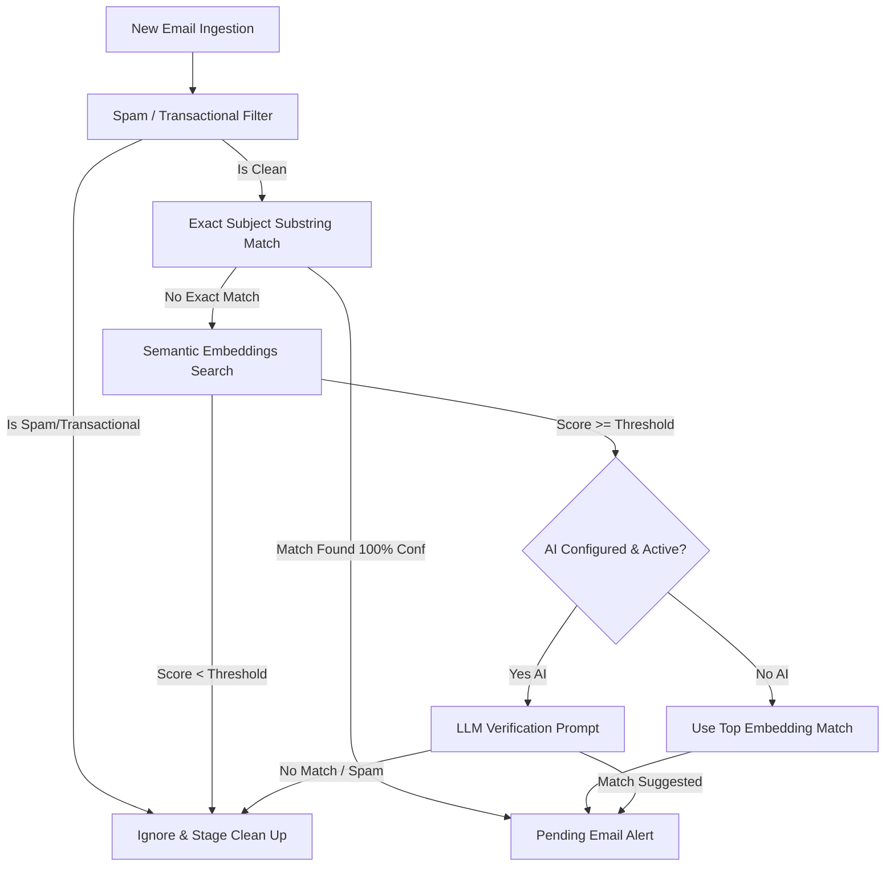

# Email Classification Flow

This document details how the automatic email classification system works in the application. The system processes incoming emails and determines which active case (if any) they belong to, notifying the user when high-confidence matches are found.

## Overview of the Pipeline

The email classification is designed as a **cascade (multi-step pipeline)** to optimize computing overhead and accuracy. It is run whenever new emails are fetched via IMAP.



---

## Detailed Implementation Steps

### 1. Ingestion and Cleaning
When emails are fetched via IMAP (triggered manually or on a 5-minute background loop in [poll_emails_background](file:///u:/home/tsemach/projects/doron-desktop/apps/desktop/src-tauri/src/email/emails_ops.rs#L51)), [emails_ingestion.rs](file:///u:/home/tsemach/projects/doron-desktop/apps/desktop/src-tauri/src/email/emails_ingestion.rs) does the following:
* Parses headers like `From`, `Subject`, and `Date`.
* Extracts the body text and strips email forward headers via [strip_forward_headers](file:///u:/home/tsemach/projects/doron-desktop/apps/desktop/src-tauri/src/email/emails_ops.rs#L138).
* Creates a text snippet (up to 500 characters) for classification.
* Stages any attachments to a temporary directory.

### 2. The Classification Cascade
The email details are evaluated by [run_cascade_classification](file:///u:/home/tsemach/projects/doron-desktop/apps/desktop/src-tauri/src/email/emails_ai.rs#L148) through the following sequential checks:

#### Step A: Spam & Transactional Filtering
* **Checks performed in:** [is_transactional_or_spam](file:///u:/home/tsemach/projects/doron-desktop/apps/desktop/src-tauri/src/email/emails_ops.rs#L63).
* **Criteria:** Checks the sender domain/address against a blocklist of common services (e.g., Slack, GitHub, LinkedIn, Zoom, credit card alerts) and filters out marketing or system messages using [BLOCKED_SUBJECT_KEYWORDS](file:///u:/home/tsemach/projects/doron-desktop/apps/desktop/src-tauri/src/email/types.rs#L69).
* **Action:** If the email is flagged as transactional/spam, the cascade terminates, temporary attachments are deleted, and the email is ignored.

#### Step B: Exact Substring Match
* **Checks performed in:** [check_exact_subject_match](file:///u:/home/tsemach/projects/doron-desktop/apps/desktop/src-tauri/src/email/emails_ai.rs#L39).
* **Criteria:** Compares the email's subject line against active case names and subjects.
* **Action:** If the subject line contains the exact name of a case, it is immediately matched with a confidence score of `1.0`.

#### Step C: Vector Embedding & Similarity Search
* **Checks performed in:** [compute_case_similarities](file:///u:/home/tsemach/projects/doron-desktop/apps/desktop/src-tauri/src/email/emails_ai.rs#L65).
* **Criteria:** The email subject, sender, and snippet are embedded into a single vector using the local embedding model ([get_query_embedding](file:///u:/home/tsemach/projects/doron-desktop/apps/desktop/src-tauri/src/email/emails_ai.rs#L187)). Cosine similarity is computed against indexed case document vectors.
* **Filtering Thresholds:**
  * If LLM verification is enabled, the required similarity threshold is **`0.76`** (relaxed).
  * If relying purely on embeddings, the required similarity threshold is **`0.84`** (strict).
* **Action:** If the similarity score is below the threshold, the email is deemed unrelated to any case and ignored. Otherwise, the top 3 candidate cases are identified.

#### Step D: LLM Verification (AI-Assisted Classification)
* **Checks performed in:** [call_llm_classification](file:///u:/home/tsemach/projects/doron-desktop/apps/desktop/src-tauri/src/email/emails_ai.rs#L103).
* **Criteria:** If AI mode is enabled and configured, a prompt is sent to the configured provider (e.g., Gemini, OpenAI, Claude, or local LLM) containing the email snippet and the top 3 candidate cases.
* **Prompt Schema:** The LLM is instructed to return a structured JSON:
  ```json
  {
    "suggested_case_id": number_or_null,
    "confidence": float_0_1,
    "reason": "explanation"
  }
  ```
* **Action:** The system uses the LLM-selected case. If the API call fails, the pipeline falls back to the top embedding match with a `0.5` confidence score.

---

### 3. Insertion & Alerting
If a matching case ID is suggested:
1. The email metadata, confidence score, and reason are inserted into the database table `pending_email_alerts` ([emails_ingestion.rs](file:///u:/home/tsemach/projects/doron-desktop/apps/desktop/src-tauri/src/email/emails_ingestion.rs#L161)).
2. A Tauri event `new-email-alert` is emitted to notify the frontend.
3. The user can review, confirm, or decline the suggestion from the alerts interface.
