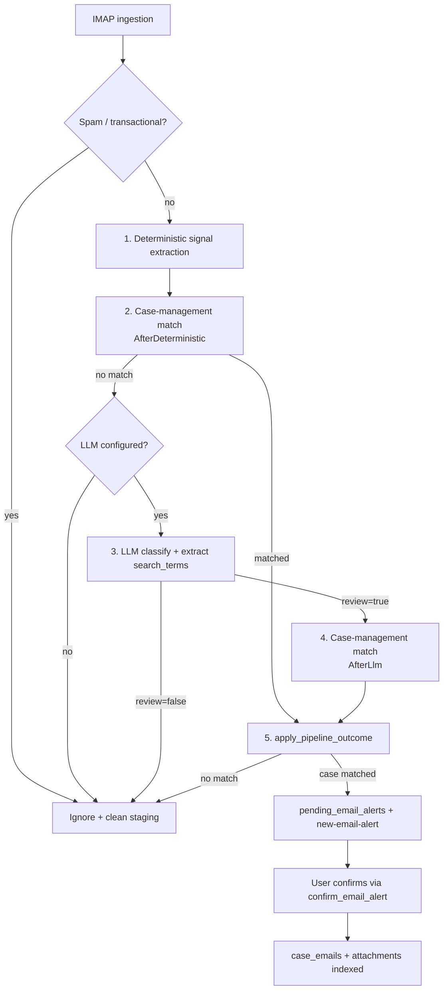

# Email Classification Flow

How incoming and sent mail is ingested, classified, matched to cases, and surfaced to the user.

The pipeline is a **five-step cascade** designed to minimize LLM cost: try cheap deterministic signals and case lookup first, only call the LLM when no confident case link exists.

---

## Pipeline overview



### Step-by-step

| Step | What happens | Module | Implemented |
|------|--------------|--------|-------------|
| 0 | IMAP fetch, parse headers/body, stage attachments | `emails_ingestion.rs` | ✅ |
| 0a | Spam / transactional filter | `emails_ops.rs` (`is_transactional_or_spam`) | ✅ |
| 1 | Regex/header signal extraction (case numbers, IDs, phones, party names, …) | `emails_classify_deterministic.rs` | ✅ |
| 2 | Case-management match on deterministic `search_terms` → **early exit** if matched (skips LLM) | `emails_case_api.rs` via `run_email_pipeline` | ⏳ stub only |
| 3 | LLM reads email; returns `review`, `summary`, `search_terms` | `emails_classify.rs` / `emails_classify_llm.rs` | ✅ |
| 4 | Case-management match again with merged deterministic + LLM terms | `emails_case_api.rs` | ⏳ stub only |
| 5 | Persist alert or ignore; user confirms to link email to case | `emails_orchestrate.rs` + `emails_alerts.rs` | ✅ alerts; ⏳ auto-connect |

Orchestration lives in [`emails_orchestrate.rs`](../../apps/desktop/src-tauri/src/email/emails_orchestrate.rs):
- `run_email_pipeline` — steps 0a–4
- `apply_pipeline_outcome` — step 5

Ingestion calls both from [`emails_ingestion.rs`](../../apps/desktop/src-tauri/src/email/emails_ingestion.rs) inside `ingest_single_email`.

---

## Module map

```
email/
├── emails_ingestion.rs      # IMAP fetch, parse, stage attachments, invoke pipeline
├── emails_orchestrate.rs    # run_email_pipeline + apply_pipeline_outcome
├── emails_classify_deterministic.rs  # Step 1: regex/header signals
├── emails_classify.rs       # Step 3: LLM wrapper + JSON repair
├── emails_classify_llm.rs     # Low-level structured LLM call
├── emails_case_api.rs         # Step 2 & 4: CaseManagementApi trait (stub today)
├── emails_alerts.rs         # Step 5: pending alerts + user confirm/delete
├── emails_ops.rs            # Tauri commands, spam filter, case email listing
├── emails_settings.rs       # IMAP settings
└── types.rs                 # Shared structs
```

---

## Tauri commands (frontend ↔ Rust)

Registered in [`lib.rs`](../../apps/desktop/src-tauri/src/lib.rs). Called from React via `invoke()`.

### Settings

| Command | Args | Returns | Purpose |
|---------|------|---------|---------|
| `get_email_settings` | — | `EmailConfig \| null` | Read IMAP credentials and provider config |
| `save_email_settings` | `config: EmailConfig` | `()` | Persist IMAP credentials |

Frontend: `Settings.tsx`

### Ingestion

| Command | Args | Returns | Purpose |
|---------|------|---------|---------|
| `trigger_email_ingestion` | — | `()` | Manually poll IMAP (INBOX unseen + Sent folder) and run the pipeline on new mail |

Also runs automatically every **5 minutes** via `poll_emails_background` (spawned at app startup).

Frontend: `OpenCasesEmailsChat.tsx`

### Alerts (step 5 — review queue)

| Command | Args | Returns | Purpose |
|---------|------|---------|---------|
| `list_pending_email_alerts` | — | `PendingAlert[]` | List emails awaiting user review; cleans up invalid rows |
| `confirm_email_alert` | `alertId: i64`, `caseId: i64` | `()` | Link email to case: move attachments, insert `case_emails`, delete alert |
| `delete_email_alert` | `alertId: i64` | `()`` | Dismiss alert; mark `ignored_emails` so it is not re-ingested |

Frontend: `CaseManagementEmailAlertReview.tsx`

### Case emails (post-connection)

| Command | Args | Returns | Purpose |
|---------|------|---------|---------|
| `list_case_emails` | `caseId: i64` | `CaseEmail[]` | Emails already linked to a case |
| `list_case_attachments` | `caseId: i64` | `AttachmentMetadata[]` | Attachments across case emails |
| `remove_attachment` | `caseId`, `attachmentName` | `()` | Remove a case attachment |

Frontend: `OpenCasesEmailsChat.tsx`, `CaseManagementOpenCasesDetails.tsx`

---

## Tauri events

| Event | Payload | When emitted | Listener |
|-------|---------|--------------|----------|
| `new-email-alert` | `()` | Pipeline matched a case → row inserted in `pending_email_alerts` | `CaseManagementEmailAlertReview.tsx` |
| `case-emails-updated` | `caseId: i64` | User confirmed an alert, or truncated email body healed | `OpenCasesEmailsChat.tsx`, `CaseManagementOpenCasesDetails.tsx` |

---

## Internal API: case management (steps 2 & 4)

Not exposed to the frontend. Implement [`CaseManagementApi`](../../apps/desktop/src-tauri/src/email/emails_case_api.rs) and register it in `resolve_case_api`.

### `match_email(app, request) → CaseMatchResult`

**Input — `CaseMatchRequest`:**

| Field | Description |
|-------|-------------|
| `message_id`, `sender`, `subject`, `snippet` | Raw email fields |
| `search_terms` | Ordered list of linking signals (deterministic only at step 2; merged at step 4) |
| `deterministic` | Full `EmailExtractedSignals` struct |
| `classification` | `None` at step 2; `Some(EmailClassification)` at step 4 |
| `phase` | `AfterDeterministic` or `AfterLlm` |

**Output — `CaseMatchResult`:**

```json
{ "case_id": 42, "confidence": 0.95, "reason": "matched case number 12345/23" }
```

A match is considered valid when `case_id` is `Some` **and** `confidence > 0.0` (`is_matched()`).

### Phases

- **`AfterDeterministic`** — match using regex-extracted signals only. A hit causes the pipeline to skip the LLM entirely.
- **`AfterLlm`** — match using merged deterministic + LLM `search_terms` (only reached when `classification.review == true`).

### Injection point

```rust
// emails_case_api.rs
pub fn resolve_case_api(app: &AppHandle) -> &dyn CaseManagementApi {
    default_case_api()  // ← replace with real implementation
}
```

Today `StubCaseManagementApi` always returns no match, so **no alerts are created** until a real matcher is wired — emails that pass LLM review are written to `ignored_emails`.

---

## Data shapes

### `EmailExtractedSignals` (step 1)

Deterministic output: `case_numbers`, `emails`, `phone_numbers`, `national_ids`, `company_ids`, `dates`, `party_names`, sender metadata. Converted to `search_terms` via `to_search_terms()`.

### `EmailClassification` (step 3 — LLM)

```json
{
  "summary": "Client requests hearing date change",
  "review": true,
  "review_reason": "Relates to active litigation",
  "search_terms": ["12345/23", "יוסי כהן", "דיון 15/3"]
}
```

- `review: false` → email ignored (marketing, OTP, personal mail).
- `search_terms` are merged with deterministic terms (deterministic wins on duplicates).

### `EmailPipelineResult`

Carries `deterministic`, optional `classification`, `case_match`, and `stop_stage`:

| `PipelineStopStage` | Meaning |
|---------------------|---------|
| `IgnoredSpam` | Blocked by spam/transactional filter |
| `DeterministicCaseMatch` | Step 2 matched; LLM skipped |
| `LlmSkippedNoProvider` | No AI configured |
| `LlmIgnoredNotForReview` | LLM said `review: false` |
| `AfterLlmCaseMatch` | Step 4 matched |
| `NoCaseMatch` | LLM reviewed but no case found |

### `PendingAlert` (step 5 — DB row)

`id`, `message_id`, `sender`, `subject`, `body_snippet`, `body_text`, `received_at`, `suggested_case_id`, `confidence`, `reason`, `attachments_json`.

---

## Database tables

| Table | Role |
|-------|------|
| `pending_email_alerts` | Emails matched to a case, awaiting user confirmation |
| `case_emails` | Emails permanently linked to a case |
| `ignored_emails` | Message IDs to skip on future IMAP polls |
| `email_configurations` | IMAP credentials (via settings commands) |

Attachments are staged on disk at `{app_data}/email_staging/{message_id}/` until confirmed or dismissed.

---

## Eval CLI (classification benchmark)

Benchmarks **step 3 only** (LLM `review` decision + `search_terms` quality). Does not exercise case matching.

```bash
# Generate / refresh fixture dataset
cargo run --bin eval --manifest-path apps/desktop/src-tauri/Cargo.toml \
  email generate

# Run live LLM eval
cargo run --bin eval --manifest-path apps/desktop/src-tauri/Cargo.toml \
  email run --provider local --model "Phi-4-mini-instruct (3.8B Q4)"

# CI mode: inject pre-baked classifications from fixtures (no LLM)
cargo run --bin eval --manifest-path apps/desktop/src-tauri/Cargo.toml \
  email run --inject-only
```

Fixtures: [`tests/email/fixtures/email_classification_dataset.json`](../../apps/desktop/src-tauri/tests/email/fixtures/email_classification_dataset.json)

`email list` / `email show` are placeholders for future run history (mirroring document eval).

---

## TODO

### Case-management connection (next PR)

- [ ] Implement `CaseManagementApi` — search active cases by `search_terms`, sender, case numbers, party names, embeddings, etc.
- [ ] Register real implementation in `resolve_case_api` (or `AppHandle` state).
- [ ] Decide matching strategy per `CaseMatchPhase` (e.g. exact case-number hit at `AfterDeterministic`; fuzzy / semantic at `AfterLlm`).
- [ ] Add eval fixtures + tests for the matcher (separate from LLM eval).
- [ ] Define confidence thresholds: when to auto-connect vs surface a pending alert.

### Step 5 — auto-connect

- [ ] High-confidence deterministic matches could skip the alert queue and link directly to `case_emails` (reuse logic from `confirm_email_alert`).
- [ ] Extract shared `link_staged_email_to_case(app, prepared, case_id)` so auto-connect and manual confirm share one code path.

### Cleanup

- [ ] Implement `eval email list` / `eval email show` for classification run history (optional).
- [ ] Remove redundant `provider` / `api_key_enc` fields from `EmailConfig` (LLM now uses global `ai_configurations`).

### Not in scope for this pipeline

- Outbound SMTP / sending mail from the app.
- Email threading / conversation grouping beyond per-message `message_id`.
- Backend (Next.js) involvement — all email logic is local in the Tauri Rust backend.
