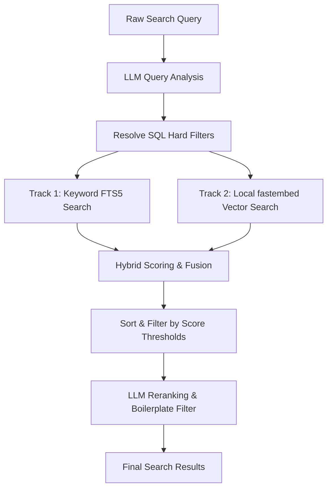

# Document Indexing and Search Architecture

This document details the architecture, algorithms, and workflows of the document indexing and search systems implemented in the Tauri application backend. 

---

## 1. Document Indexing Pipeline

The indexing pipeline extracts text, generates structured metadata via a cloud LLM, and creates local vector embeddings for semantic search.

### Indexing Flow Diagram

```mermaid
graph TD
    A[File Input] --> B{Check DB}
    B -- Already Indexed -- --> C[Skip / Done]
    B -- New File -- --> D[Text Extraction]
    D --> E[Cloud Metadata Extraction]
    E --> F[Save to SQLite documents table]
    F --> G[Automatic SQLite Trigger: Index to FTS5]
    F --> H[Split Text into Chunks]
    H --> I[Generate Embeddings locally via fastembed]
    I --> J[Save Chunks & Vectors to document_chunks table]
```

### Steps in Detail

#### Step 1: Filter & Check
* **Entry Point:** [`index_folder`](file:///u:/home/tsemach/projects/doron-desktop/apps/desktop/src-tauri/src/indexer/mod.rs#L23) or [`index_file`](file:///u:/home/tsemach/projects/doron-desktop/apps/desktop/src-tauri/src/indexer/mod.rs#L191).
* **Supported formats:** `.docx`, `.pdf`, `.xlsx`, `.xls`, `.txt`.
* **Deduping:** The database is queried to ensure the file path is not already indexed (skipped unless `reindex` is set to true).

#### Step 2: Local Text Extraction
* The backend reads the file in-process using target-specific extractors:
  * **`.docx`:** Unzipped and parsed with `quick-xml` (`extractor/docx.rs`).
  * **`.pdf`:** Extracted via the `pdf-extract` crate (`extractor/pdf.rs`).
  * **`.xlsx`/`.xls`:** Parsed using `calamine` (capped at 200 rows per sheet) (`extractor/xlsx.rs`).

#### Step 3: Cloud Metadata Extraction (Online LLM)
* The text is truncated (first 12,000 characters) and sent to the cloud LLM (Claude).
* It extracts structural attributes returned in a JSON schema:
  ```json
  {
    "doc_type": "contract | report | invoice | memo | etc.",
    "title": "Document title",
    "summary": "2-3 sentence summary",
    "authors": ["Author names"],
    "date": "YYYY-MM-DD or null",
    "topics": ["Key topics"],
    "entities": ["Companies, people, places"],
    "language": "ISO 639-1 code",
    "keywords": ["Search keywords"]
  }
  ```

#### Step 4: Local Chunking & Vector Generation (Local AI)
* **Chunking:** The document's raw text is divided into overlapping chunks of **1000 characters** with an overlap of **200 characters**.
* **Vector Generation:** The chunks are passed to the **`fastembed`** library running `MultilingualE5Small`.
* **Database storage:** Each chunk, along with its 384-dimensional float vector (stored as raw binary bytes in a `BLOB` column), is saved to the `document_chunks` database table.
* **FTS5 Indexing:** Database triggers automatically index the metadata and text inside SQLite’s Full-Text Search index (`documents_fts`).

---

## 2. Hybrid Search Pipeline

The search engine executes a multi-track retrieval model that merges local SQL metadata filtering, Full-Text Search (FTS5), and vector similarity.

### Search Flow Diagram



### Step-by-Step Search Algorithm

#### Step 1: Query Analysis (Online LLM)
* **Method:** [`llm::analyze_query`](file:///u:/home/tsemach/projects/doron-desktop/apps/desktop/src-tauri/src/query/llm.rs#L46)
* **Action:** The query string is sent to the online LLM to isolate entities, date ranges, document type filters, and keywords (removing search-related verbs like *"find"* or *"show"*).

#### Step 2: Hard Filtering (Local SQL)
* **Method:** [`get_filtered_document_ids`](file:///u:/home/tsemach/projects/doron-desktop/apps/desktop/src-tauri/src/query/queries.rs#L7)
* **Action:** Compiles structured attributes (dates, doc types, entities) into a local SQL query against the `documents` table to produce a subset of matching document IDs.

#### Step 3: FTS Keyword Match (Track 1)
* **Method:** [`query_by_fts_with_filter`](file:///u:/home/tsemach/projects/doron-desktop/apps/desktop/src-tauri/src/query/queries.rs#L93)
* **Action:** Matches keywords inside the FTS5 virtual table. SQLite FTS ranks results where a *lower* rank is a better match. The engine normalizes this into a positive score:
  $$\text{FTS Score} = 100.0 - \text{FTS Rank}$$

#### Step 4: Local Vector Similarity (Track 2)
* **Method:** [`query_by_vector`](file:///u:/home/tsemach/projects/doron-desktop/apps/desktop/src-tauri/src/query/queries.rs#L137)
* **Action:** 
  1. The user's query text is converted into a vector locally using `fastembed`’s `get_query_embedding` function.
  2. The database loads all stored chunk embeddings.
  3. The cosine similarity is calculated in-memory in Rust between the query vector and every chunk vector.
  4. **Max-Pooling:** The document’s overall vector score is the **maximum** similarity score found among any of its chunks:
     $$\text{Vector Score}_{\text{doc}} = \max \left( \text{Similarity}(\text{Query}, \text{Chunk}_i) \right)$$

#### Step 5: Score Fusion and Relevance Verification
For every document returned, the engine runs a hybrid fusion algorithm:
1. **Strict Relevance Filtering:** The match is discarded unless it satisfies the following threshold:
   $$\text{Is Relevant} = (\text{Vector Score} \ge 0.75) \lor (\text{FTS Score} > 0.0 \land \text{Vector Score} \ge 0.68)$$
2. **Score Fusion Formula:** Relevant matches are merged into a combined score:
   $$\text{Combined Score} = \text{Vector Score} + \frac{\text{FTS Score}}{200.0}$$
   *This combines the semantic richness of vectors with keyword exact-match boosts.*
3. **Relative Thresholding:** Matches scoring more than `0.15` below the top scoring document are filtered out:
   $$\text{Score}_{\text{doc}} \ge \text{Top Score} - 0.15$$

#### Step 6: Reranking & Final Filtering (Online LLM)
* **Method:** [`llm::rerank_candidates`](file:///u:/home/tsemach/projects/doron-desktop/apps/desktop/src-tauri/src/query/llm.rs#L55)
* **Action:** The surviving candidates (titles and summaries) are sent to Claude alongside the user query to perform a final semantic verification, filtering out boilerplate matches, and ordering them in final relevance order.

---

## 3. Transition to 100% Local Offline Operation

Currently, the application relies on cloud APIs at three integration points. To run offline on 8GB/16GB CPU-only machines, these points must be modified:

### 1. Indexing Metadata Extraction
* **Current:** Claude parses document text and returns metadata JSON.
* **Local Solution:** Run a local **Qwen-2.5-3B-Instruct** (or **1.5B** for 8GB systems) in GGUF format (Q4_K_M) via **Ollama**. Send the text to `http://localhost:11434/v1` using your existing [`OpenAiProvider`](file:///u:/home/tsemach/projects/doron-desktop/apps/desktop/src-tauri/src/llm/llm_provider_openai.rs).

### 2. Search Query Analysis
* **Current:** Claude extracts keywords/dates from the search input.
* **Local Solution:** Route the query analysis prompt to the same local Qwen model via Ollama.

### 3. Candidates Reranking
* **Current:** Claude performs the final filter on local matches.
* **Local Solution:** 
  - *Option A:* Pass candidate lists to the local Qwen LLM via Ollama.
  - *Option B (Recommended for Speed):* Remove this step entirely and rely purely on the local hybrid score ranking. The vector threshold ($\ge 0.75$) combined with FTS is already highly accurate and runs instantly.
