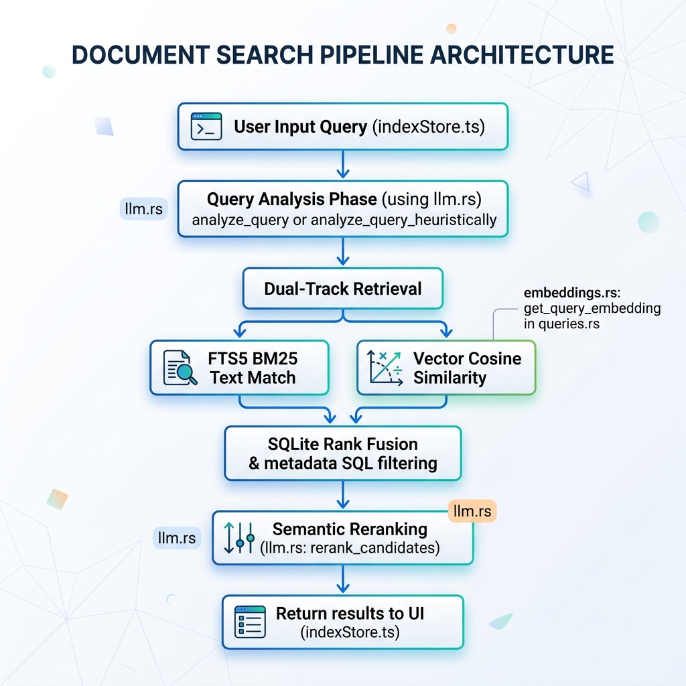
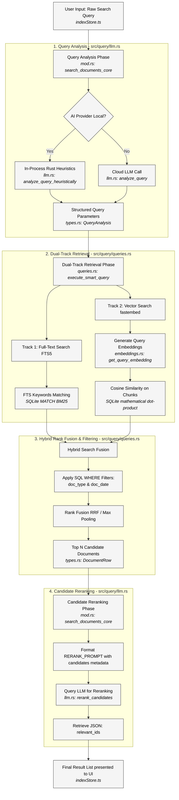

# Flow Diagram: Hybrid-Rerank Document Search Pipeline

This document details the complete end-to-end execution flow of a search query when the **`hybrid-rerank`** algorithm is active. It combines structured database filtering, vector embeddings, and LLM-powered reordering.

---

## 1. Sequence Flowchart

### Mermaid Source Code

---

## 2. Pipeline Stage Breakdown

### Stage 1: Query Analysis
*   **File**: [src-tauri/src/query/mod.rs](file:///home/tsemach/projects/doron-desktop/apps/desktop/src-tauri/src/query/mod.rs) and [src-tauri/src/query/llm.rs](file:///home/tsemach/projects/doron-desktop/apps/desktop/src-tauri/src/query/llm.rs)
*   **Core Functions**: 
    *   `search_documents_core` parses options to choose the analysis path.
    *   `llm::analyze_query` invokes the configured AI model with `QUERY_ANALYSIS_PROMPT` to request structured extraction.
    *   `llm::analyze_query_heuristically` acts as the fallback, parsing queries directly in Rust using regex and string matching to pull categories, names, and date ranges.
*   **Outputs**: `QueryAnalysis` struct defined in [src-tauri/src/query/types.rs](file:///home/tsemach/projects/doron-desktop/apps/desktop/src-tauri/src/query/types.rs).

### Stage 2: Dual-Track Retrieval
*   **File**: [src-tauri/src/query/queries.rs](file:///home/tsemach/projects/doron-desktop/apps/desktop/src-tauri/src/query/queries.rs) and [src-tauri/src/embeddings.rs](file:///home/tsemach/projects/doron-desktop/apps/desktop/src-tauri/src/embeddings.rs)
*   **Core Functions**:
    *   `queries::execute_smart_query` dispatches the database requests.
    *   **Track 1 (Text Match)**: SQLite queries run FTS5 `MATCH` queries over extracted keywords, scoring matches with `bm25()`.
    *   **Track 2 (Semantic Vector)**: `embeddings::get_query_embedding` computes a 384-dimensional query vector using the native `fastembed` model, then executes an SQLite math query evaluating cosine similarity between the query vector and indexed document chunk vectors.

### Stage 3: Rank Fusion & Filtering
*   **File**: [src-tauri/src/query/queries.rs](file:///home/tsemach/projects/doron-desktop/apps/desktop/src-tauri/src/query/queries.rs)
*   **Core Functions**:
    *   `queries::execute_smart_query` applies the SQLite `WHERE` constraints for metadata filtering (using `doc_type` and `doc_date` from query analysis).
    *   It merges results from FTS and vector tracks using a weighted fusion or max-pooling algorithm to select the top candidate matches.
*   **Outputs**: `Vec<DocumentRow>` candidates list.

### Stage 4: Candidate Reranking
*   **File**: [src-tauri/src/query/llm.rs](file:///home/tsemach/projects/doron-desktop/apps/desktop/src-tauri/src/query/llm.rs)
*   **Core Functions**:
    *   `llm::rerank_candidates` formats the candidate rows (ID, title, summary) into `RERANK_PROMPT` as a JSON string.
    *   It executes the structured request to the active `LlmProvider` (e.g. `call_structured`), receiving a `relevant_ids` list representing the final reordered list from most to least relevant.
    *   Returns the reordered `Vec<DocumentRow>` results to `search_documents_core` which returns them to the UI frontend.

